# MPhil DIS C2: Cholesky Factorisation with OpenMP on CSD3

**Iuliia Vitiugova** · MPhil in Data Intensive Science · University of Cambridge · Lent Term 2026

---

## 1. Introduction

This report documents the incremental development of an in-place Cholesky factorisation routine in C++17. Given a symmetric positive-definite matrix **C**, the routine computes the lower-triangular factor **L** such that

\f[\mathbf{C} = \mathbf{L}\mathbf{L}^\top\f]

overwriting **C** in-place. The log-determinant follows without computing the full determinant (spec Eq. 4):

\f[\log|\det \mathbf{C}| = 2\sum_{p=0}^{n-1} \log L_{pp}\f]

Four implementations are provided, selected at compile time via `-DCHOLESKY_VERSION=N`:

| Version | Description | Git tag |
|---------|-------------|---------|
| 0 | Serial baseline — direct pseudocode transcription | `v0_serial_correct` |
| 1 | Serial optimised — five micro-optimisations | `v1_serial_optimised` |
| 2 | OpenMP parallel — persistent thread team | `v2_openmp_parallel` |
| 3 | OpenMP tuned — column scaling parallelised | `v3_column_scaling` |

**Public API:** `double mphil_dis_cholesky(double* c, int n)` returns wall-clock seconds (\f$t \geq 0.0\f$; may be exactly 0.0 for sub-microsecond runs on small \f$n\f$), \f$-1.0\f$ for invalid input, or \f$-2.0\f$ if the matrix is not SPD. The lower triangle stores **L**; the upper triangle mirrors \f$L^\top\f$.

---

## 2. Tagged Commits

| Tag | Commit | Description |
|-----|--------|-------------|
| `v0_tests` | `3836555` | Initial 27-test correctness suite |
| `v0_1_tests` | `4f4613c` | Extended test suite (n=2 spec example) |
| `v0_serial_correct` | `61154f2` | VERSION 0 baseline implementation |
| `v0_example` | `c5d90cf` | Example program with corr() matrix |
| `v1_serial_optimised` | `f9b93ab` | VERSION 1: five serial optimisations |
| `v2_openmp_parallel` | `98910e0` | VERSION 2: OpenMP persistent region + SIMD |
| `v3_column_scaling` | `b5605f7` | VERSION 3: column scaling parallelised |

---

## 2.5 Project Roadmap (V0 → V3)

The four implementations form a deliberate, evidence-driven progression. Each version targets a measured bottleneck identified in the preceding stage; every claim is backed by data before the next stage begins.

```
+---------------------+    +---------------------+    +--------------------+    +--------------------+
|    V0  BASELINE     |--->|   V1  SERIAL OPT    |--->|    V2  OPENMP      |--->|  V3  TUNED OPENMP  |
| v0_serial_correct   |    | v1_serial_optimised |    | v2_openmp_parallel |    | v3_column_scaling  |
+---------------------+    +---------------------+    +--------------------+    +--------------------+
| Spec pseudocode     |    | Loop swap: i-outer  |    | Persistent omp     |    | Column scaling ->  |
| j-outer / i-inner   |    |   / j-inner (OPT-1) |    |   parallel region  |    |   omp for          |
| No optimisations    |    | Hoist row pointers  |    | omp single +       |    | Removes O(n^2)     |
|                     |    | inv_diag reciprocal |    |   barrier per step |    |   DRAM-latency     |
|                     |    | Hoist Lip           |    | schedule(static)   |    |   serial stall     |
|                     |    | 4-wide i-unrolling  |    | simd + __restrict_ |    |                    |
+---------------------+    +---------------------+    +--------------------+    +--------------------+
| EVIDENCE:           |    | EVIDENCE:           |    | EVIDENCE:          |    | EVIDENCE:          |
| 35 tests pass       |    | 39 tests pass       |    | 38 tests pass      |    | 42 tests pass      |
| example/main.cpp    |    | T=1 comparison      |    | n x T sweep:       |    | Same-node V2/V3:   |
| benchmark harness   |    | Sec 9.1 / 10.1      |    |   icelake + cclake |    |   job 26164912,    |
|                     |    |                     |    | NUMA close/spread  |    |   cpu-q-583; +26%  |
|                     |    |                     |    | Sec 9.2-9.4 / 10.x |    | Sec 9.5 / 10.5     |
+---------------------+    +---------------------+    +--------------------+    +--------------------+
```

**Deliverable artefacts** — available at each stage:

- **API contract:** `mphil_dis_cholesky(double* c, int n)` — in-place factorisation; returns wall-clock seconds (\f$\geq 0.0\f$), \f$-1.0\f$ (invalid input), or \f$-2.0\f$ (non-SPD).
- **Test suite** (`test/test_cholesky.cpp`, no framework, 35/39/38/42 tests for V0/V1/V2/V3): spec example, analytical matrices, SPD reconstruction, log-det identity, error returns, structural invariants, step oracle, OpenMP thread invariance, V3 parallelism proof, V1 tail/OPT-1 proofs, barrier sanity, second SPD family — pass all versions at `OMP_NUM_THREADS=1`.
- **Example program** (`example/main.cpp`): `corr(n)` SPD input → factorisation → logdet + GFLOP/s printed.
- **Benchmark harness** (`benchmark/benchmark.cpp`): sweeps sizes × threads × repeats; emits CSV with hostname, jobid, version, and upper-median GFLOP/s.
- **CSD3 SLURM jobs** (`jobs/`): icelake and cclake sweeps, NUMA close/spread experiment, same-node V2/V3 comparison (job 26164912, cpu-q-583).
- **Plotting pipeline** (`scripts/plot_bench.py`): CSVs → 19 figures + peak-summary tables (full ledger in §8.2).

*This roadmap maps the optimisation and parallelisation strategies attempted, the justification mechanism (tests + targeted experiments), and the performance evidence (tables/figures) needed for reproducibility.*

---

## 3. Algorithm

The outer-product (right-looking) Cholesky algorithm processes pivot columns \f$p = 0, \ldots, n-1\f$. At step \f$p\f$:

1. \f$L_{pp} = \sqrt{C_{pp}}\f$
2. Scale row \f$p\f$: \f$L_{pj} = C_{pj} / L_{pp}\f$ for \f$j > p\f$
3. Scale column \f$p\f$: \f$L_{ip} = C_{ip} / L_{pp}\f$ for \f$i > p\f$
4. Schur complement: \f$C_{ij} \leftarrow C_{ij} - L_{ip} \cdot L_{pj}\f$ for all \f$i, j > p\f$

Step 4 is \f$O(n^2)\f$ per pivot, giving \f$O(n^3/3)\f$ total FMAs. Performance is measured in GFLOP/s:

\f[\text{GFLOP/s} = \frac{n^3}{3 \cdot t \cdot 10^9}\f]

where \f$t\f$ is wall-clock time in seconds.

---

## 4. Serial Implementations

### 4.1 Baseline: V0

V0 is a deliberate direct transcription of the spec pseudocode (`v0_serial_correct`, commit `61154f2`). The Schur complement uses a j-outer / i-inner loop nest, mirroring §3 step-for-step without modification. All three sub-operations (sqrt, row scaling, column scaling) run sequentially with no micro-optimisations applied.

**Rationale.** Correctness precedes performance. V0 provides a clean reference implementation against which the test suite (§7, Groups A–F, 27 checks) was validated first. A pseudocode-faithful baseline is also less likely to contain cache-aware bugs that could mask numerical errors; any deviation in V1–V3 output can be diagnosed by bisection against V0's bit-identical results.

**Expected performance.** The j-outer loop accesses \f$C[i \cdot n + j]\f$ with stride \f$n \times 8\f$ bytes — at \f$n=1000\f$, skipping 125 cache lines per iteration. DRAM latency is the binding constraint; IPC is near zero due to load stalls. The measured 0.15–1.00 GFLOP/s (§9.1) quantifies the access-pattern cost, not a scalar-arithmetic baseline.

**Observed bottlenecks — motivation for V1.**

| V0 deficiency | Root cause | V1 fix (OPT) |
|---------------|-----------|---------------|
| Stride-\f$n\f$ inner access | j-outer iterates \f$C[i \cdot n + j]\f$: stride \f$n \times 8\f$ bytes per step | Loop swap to i-outer / j-inner (OPT-1) |
| Index arithmetic per element | \f$i \cdot n + p\f$ recomputed every inner iteration | Hoist row pointers outside inner loops (OPT-2) |
| \f$n-p-1\f$ divisions per pivot step | IEEE division ≈ 20 cycles; repeated across j-inner | One reciprocal `inv_diag = 1/L_{pp}`; multiply instead (OPT-3) |
| \f$L_{ip}\f$ re-read on every j-iteration | `row_i[p]` fetched from cache once per FMA | Hoist `Lip = row_i[p]` before j-loop (OPT-4) |

Each deficiency is independently measurable — via hardware counters, compiler output, or targeted micro-benchmarks — and independently fixable. This traceable diagnosis-to-fix chain is the design principle of V1: no change is speculative; each OPT is motivated by a distinct, identifiable runtime bottleneck.

### 4.2 V1: Five Micro-Optimisations

Five targeted optimisations, each addressing a distinct bottleneck:

| OPT | Bottleneck | Change |
|-----|-----------|--------|
| 1 | Stride-\f$n\f$ inner access (\f$n \times 8\f$ bytes/step) | Swap to i-outer / j-inner → stride-1 |
| 2 | Index arithmetic (\f$p \times n\f$) per element | Hoist row pointers outside inner loops |
| 3 | \f$n-p-1\f$ divisions per step | One `inv_diag = 1/diag`; multiply instead |
| 4 | Re-reading \f$L_{ip}\f$ in every \f$j\f$ iteration | Hoist `Lip = row_i[p]` before j-loop |
| 5 | One `row_p[j]` load per FMA | 4-wide i-unrolling: one load, four FMAs |

OPT-1 is dominant: it restores \f$O(1)\f$ cache lines per iteration from \f$O(n)\f$. OPT-3 saves \f$\sim n^2/2\f$ division latencies (~20 cycles each) by replacing them with multiplications (~4 cycles). Measured single-thread performance and the V1 vs V2 comparison are in §9.1.

---

## 5. OpenMP Parallel Implementation (V2)

**Strategy summary.** V2 keeps the serial outer loop over pivot steps \f$p = 0,\ldots,n-1\f$ and parallelises only the \f$O(n^2)\f$ Schur complement at each step. A single persistent `omp parallel` region wraps all \f$n\f$ steps, eliminating per-step fork/join cost. Within each step, `omp single` performs the \f$O(n)\f$ serial sub-tasks (pivot check, sqrt, row and column scaling, local `inv_diag` computation), and `omp for schedule(static)` distributes the independent Schur rows across the full thread team. Two implicit barriers — one after `omp single`, one after `omp for` — enforce the read-after-write ordering between consecutive pivot steps.

**Why a persistent parallel region.** Fork/join overhead is ~5–20 µs per team creation. One `#pragma omp parallel` wrapping all \f$n\f$ steps amortises this to a single event. The p-loop cannot itself be parallelised: step \f$p\f$ has a true read-after-write dependence on the \f$C_{ij}\f$ values updated in step \f$p-1\f$.

Per-step structure:

```
#pragma omp parallel default(none) shared(c, n, err)          ← V2 shared clause
  for p = 0..n-1:
    #pragma omp single     ← sqrt, row/col scaling, inv_diag (local)  [O(n) serial]
      [implicit barrier]   ← all threads see row_p and col_p before Schur
    #pragma omp for schedule(static)  ← parallel Schur complement     [O(n²) parallel]
      [implicit barrier]   ← step p complete before next pivot
```

*Note: in V3, column scaling (`c[i*n+p] *= inv_diag`) moves from `omp single` into `omp for`, and `inv_diag` becomes a shared variable (`shared(c, n, err, inv_diag)`). See §6.*

**Design reasoning.** `omp single` (not `omp master`) provides an *implicit barrier*: without it, threads would enter the Schur complement before `row_p` is fully written. `schedule(static)` gives optimal load balance at zero overhead because each row \f$i\f$ costs exactly \f$n-p-1\f$ FMAs — uniform work. `#pragma omp simd` + `__restrict__` assert no aliasing between `row_i` and `row_p`, enabling clean AVX-512 without a runtime alias check. `omp for` threads write \f$C[i, p{+}1..n{-}1]\f$ for their own static partition of rows \f$i > p\f$ — disjoint ranges, no write conflicts. Scaling results and heatmaps are in §9.2.

---

## 6. Tuning Experiment (V3): Parallelise Column Scaling

**Bottleneck identification.** In V2, column scaling (`c[i*n+p] *= inv_diag` for \f$i > p\f$) runs inside `omp single`, contributing \f$O(n^2)\f$ serial work. The operation-count argument predicts serial fraction \f$s \approx 3/n \approx 0.15\%\f$ at \f$n=2000\f$; Amdahl's ceiling \f$S_\infty = 1/s\f$ would then be enormous. The observed serial fractions (§10.2) are far larger — revealing that the bottleneck is **memory access pattern**, not FLOPs.

Column scaling accesses \f$C[i \cdot n + p]\f$ for sequential \f$i\f$: a stride of \f$n \times 8 = 32\f$ KB at \f$n=4000\f$, causing one DRAM miss per element on the 128 MB matrix. At \f$T=64\f$, 63 threads wait while one thread serialises these DRAM-bound accesses.

**Change.** `inv_diag` is promoted to shared; column scaling moves into `omp for` — each thread scales its own `row_i[p]` then reads it as `Lip`. The post-single barrier guarantees `inv_diag` is visible; static scheduling ensures exclusive row ownership. Row scaling remains in `omp single` since `row_p` must be complete before the Schur loop reads it.

The improvement is concentrated in the mid-\f$n\f$, mid-\f$T\f$ region (peak +41% at \f$n=2000\f$/\f$T=32\f$); negligible at \f$T=1\f$ and at \f$n=8000\f$ (DRAM saturation dominates). Full data and figures in §9.6; mechanism in §10.5.

---

## 7. Test Methodology

Two test executables are built alongside the library:

- **`cholesky_test_n2`** — a standalone smoke test (`test/test_n2.cpp`). It runs the spec's own 2×2 example $\mathbf{C} = \bigl[\begin{smallmatrix}4&2\\2&26\end{smallmatrix}\bigr]$ and checks every element of the stored result against the expected value $\bigl[\begin{smallmatrix}2&1\\1&5\end{smallmatrix}\bigr]$ within tolerance $10^{-12}$. The stored result is symmetric — the implementation writes $L$ into the lower triangle and $L^\top$ into the upper, so after the call `c = [2, 1, 1, 5]`, not the purely lower-triangular $\bigl[\begin{smallmatrix}2&0\\1&5\end{smallmatrix}\bigr]$.

- **`cholesky_test`** — the full suite (`test/test_cholesky.cpp`, no external framework). It runs under `ctest` with `OMP_NUM_THREADS=1` as the default; groups that need multiple thread counts call `omp_set_num_threads()` internally to override this (per OpenMP 5.1 §2.4). Test counts by version: V0 → 35, V1 → 39, V2 → 38, V3 → 42. All checks use `t >= 0.0` (not `t > 0.0`) because on tiny-$n$ inputs `omp_get_wtime()` returns exactly `0.0`; error codes $-1.0$ and $-2.0$ are unambiguously negative.

The test hook `mphil_dis_cholesky_step()` — and the TID recorder and write-stride probe it relies on — live in a separate translation unit (`src/mphil_dis_cholesky_testing.cpp`). This file is compiled only into the static library `cholesky_testing_hooks`, which is linked exclusively to `cholesky_test` and `cholesky_test_n2`. The production library `cholesky_lib` (and therefore `cholesky_example` and `cholesky_benchmark`) contains no test code.

### 7.1 Test groups

| Group | Function(s) | Versions | Checks (V3) | Property verified |
|-------|-------------|----------|-------------|-------------------|
| A — Spec example | `test_spec_2x2` | all | 2 | Spec §1 2×2 example: stored array after the call equals `[2, 1, 1, 5]` within $10^{-14}$. This is the ground-truth case given in the spec; any implementation error shows up immediately. Return value `t >= 0.0` checked separately. |
| B — Analytical | `test_scalar_n1`, `test_identity`, `test_scaled_identity` | all | 8 | $n=1$ scalar ($\sqrt{4}=2$, tol $10^{-14}$); identity $\mathbf{I}_n$ (diagonal $\equiv 1$, tol $10^{-14}$; logdet $\equiv 0$, tol $10^{-13}$); $k\mathbf{I}_n$ (diagonal $= \sqrt{k}$, tol $10^{-13}$; logdet $= n\log k$, tol $10^{-11}$). Closed-form $\mathbf{L}$ is known exactly; catches sign errors, off-diagonal contamination, and wrong diagonal scaling. |
| C — Backward error | `test_corr_backward` | all | 5 | $\|\mathbf{C} - \hat{\mathbf{L}}\hat{\mathbf{L}}^\top\|_F / \|\mathbf{C}\|_F \leq (10 \text{ or } 20)\,n\varepsilon$ for corr() SPD matrices at $n \in \{5, 16, 64, 128, 200\}$ (factor 20 for $n \geq 128$). Reconstruction uses only the lower triangle of the stored result to compute $\hat{\mathbf{L}}$; symmetry bugs are therefore not detected here and are covered separately by Group F. |
| D — Log-det identity | `test_logdet_2x2_analytical`, `test_logdet_corr_sign` | all | 2 | Spec Eq. (4): $\log|\det\mathbf{C}| = 2\sum_p \log L_{pp}$. `test_logdet_2x2_analytical`: exact check against $\log(100)$, tol $10^{-13}$. `test_logdet_corr_sign(64)`: finite, $\leq 0$ (Hadamard), and matches an inline V0-pseudocode reference within $n \cdot 10^{-12}$. Ties to the primary scalar output of the spec. |
| E — Invalid inputs | `test_invalid_inputs`, `test_non_spd` | all | 6 | Null pointer, $n \leq 0$, $n > 10^5$ each return $-1.0$. Non-SPD matrix returns $-2.0$. |
| F — Structural | `test_structure` | all | 4 | After the call: $c[i \cdot n + j] = c[j \cdot n + i]$ within $10^{-13}$ for all $i \neq j$ (lower–upper symmetry); $L_{pp} > 0$ for all $p$. These are separate from backward error: a wrong mirroring direction would pass Group C but fail here. |
| G — Step oracle | `test_step_level` | all | 2 | Per-pivot comparison of `mphil_dis_cholesky_step()` (production code path) against `ref_step()` (independent serial reference) for $n \in \{5, 16\}$; tolerance $50\,n\varepsilon\,\|\mathbf{C}\|_\infty$ after every step. Catches subtle one-step bugs (wrong loop bound, missing scale) that cancel in the end-to-end result. Compiled under `MPHIL_CHOLESKY_TESTING=1` only. |
| H — Thread invariance | `test_openmp_thread_invariance` | V2, V3 | 2 | Backward error and logdet at $T \in \{1,2,4,8,16\}$: logdet deviation from $T=1$ must be $\leq 10^{-10}$. Confirms no data races and no thread-count-dependent numerical results. Compiled under `_OPENMP`. |
| H2 — V3 col-scaling parallel | `test_v3_col_scaling_parallel` | V3 only | 4 | At $n=256$, $T=8$, $p=0$: inspects `mphil_dis_last_col_writer_tids()` recorded during `mphil_dis_cholesky_step()`; asserts $\geq 2$ distinct thread IDs. Proves column scaling is actually parallel in V3, distinguishing it from V2 where the same operation runs serially inside `omp single`. Compiled under `MPHIL_CHOLESKY_TESTING && _OPENMP && CHOLESKY_VERSION==3`. |
| I — V1 tail coverage | `test_v1_tail_coverage` | V1 only | 2 | `mphil_dis_cholesky_step()` at $n \in \{6, 7\}$, $p=0$ where $(n-p-1)\%4 \in \{1,2\}$: checks only the scalar-tail rows element-wise against `ref_step()`. A wrong loop bound in OPT-5 silently skips those rows; Groups C–G do not expose this because the 4-wide rows are unaffected. Compiled under `MPHIL_CHOLESKY_TESTING && CHOLESKY_VERSION==1`. |
| I2 — V1 OPT-1 structural | `test_v1_opt1_structural` | V1 only | 2 | Calls `mphil_v1_schur_write_stride()` which returns the address delta between the first two writes in the scalar-tail j-loop; asserts delta $= 1$ (j-inner, OPT-1 active), not $n$ (i-inner, V0 order). Only non-timing proof that OPT-1 is operative. Compiled under `MPHIL_CHOLESKY_TESTING && CHOLESKY_VERSION==1`. |
| J — Barrier sanity | `test_barrier_sanity` | V2, V3 | 1 | `mphil_dis_cholesky_step()` at $T=8$, $n=200$, $p=0$ on a $100\times$-scaled corr matrix. A missing implicit barrier after `omp single` would let threads read the unscaled `row_p[j]`, producing Schur errors $\approx 4.5$ per element — twelve orders of magnitude above tolerance $50\,n\varepsilon$. Compiled under `MPHIL_CHOLESKY_TESTING && _OPENMP`. |
| K — SPD stress | `test_spd_stress` | all | 6 | Backward error (tol $20\,n\varepsilon$) and logdet (tol $n \cdot 10^{-12}$ vs inline reference) for $\mathbf{C} = \mathbf{A}\mathbf{A}^\top + 0.1\mathbf{I}$ ($A_{ij} = \sin((i+1)(j+1))/\sqrt{n}$) at $n \in \{8, 40\}$. Confirms correctness is not restricted to the corr() family. |

### 7.2 Correctness validation strategy

**Groups A–F (27 checks, all versions)** form the baseline correctness certificate. They cover: the spec ground-truth example, three closed-form matrix families with known $\mathbf{L}$, five backward-error sizes, the log-det identity, all error-return codes, and the in-place symmetry invariant. All 27 pass for V0–V3.

**Group G (2 checks, all versions)** provides per-step correctness proof via `test_step_level`. Instead of checking only the final output, it compares `mphil_dis_cholesky_step()` against `ref_step()` after every pivot, catching bugs that accumulate over steps or cancel in the full factorisation.

**Groups H and H2 (2+4 checks, V2/V3 and V3)** prove the OpenMP implementation. `test_openmp_thread_invariance` rules out data races by requiring logdet to be thread-count-invariant; `test_v3_col_scaling_parallel` then proves structurally — by inspecting which threads wrote which column entries — that V3's column scaling actually runs in parallel, a property that H cannot verify because both V2 and V3 produce numerically correct results.

**Groups I, I2, J** close targeted gaps for specific optimisations. `test_v1_tail_coverage` and `test_v1_opt1_structural` guard V1's scalar tail and loop-order claim. `test_barrier_sanity` guards V2/V3 barrier semantics using a scaled matrix that makes missing-barrier corruption catastrophically large.

**Group K** rules out a corr()-specific implementation by testing a second deterministic SPD family.

All groups pass for all versions (V0–V3).

---

## 8. Benchmark Methodology

| Partition | CPU | Cores | Memory BW |
|-----------|-----|-------|-----------|
| icelake | Intel Xeon Platinum 8368Q | \f$2 \times 38 = 76\f$ | ~204 GB/s |
| cclake  | Intel Xeon Gold 6248R    | \f$2 \times 28 = 56\f$ | ~141 GB/s |

### 8.1 Performance Testing Protocol

**Build:** CMake Release, GCC 11, `-march=icelake-server` / `-march=cascadelake`. **Pinning:** `OMP_PROC_BIND=close`, `OMP_PLACES=cores`.

**Measurement:** One warm-up, three timed repeats from identical SPD input (`corr()`, spec p.5). Upper-median reported as `run=-1`.

**Protocol rationale.** The warm-up run eliminates first-call overheads (page faults, cold instruction cache). The `corr(n)` matrix is regenerated from fixed parameters before each timed run to prevent a warm-cache bias between repeats. The upper-median of three samples (not the minimum) is reported because the minimum captures an unreproducibly ideal cache state; the upper-median is stable across independent re-runs. Correctness tests always run with `OMP_NUM_THREADS=1` (enforced by CMake `set_tests_properties` — see §7).

**Thread-control precedence.** OpenMP thread count can be set at three levels: `omp_set_num_threads()` (lowest priority, overridden at runtime), `OMP_NUM_THREADS` (mid-level environment variable), and the SLURM `--cpus-per-task` resource allocation (highest — governs physical core availability). All benchmarks set both `OMP_NUM_THREADS=<T>` and `--cpus-per-task=<T>` to guarantee exactly \f$T\f$ cores are reserved from the scheduler. `OMP_PROC_BIND=close OMP_PLACES=cores` then pins each thread to a dedicated physical core, preventing OS migration and suppressing jitter from thread sharing across the dual-socket boundary.

**Timing scope.** The benchmark timer wraps only the `mphil_dis_cholesky()` call. Memory allocation and `corr(n)` generation are excluded. Between timed runs the in-place array is restored by `memcpy` from a pre-computed copy — not re-computed. Runs returning \f$< 0\f$ (invalid input or non-SPD detection) are flagged and excluded from the median.

### 8.2 Experiment Ledger

| Investigation | Partition | Node / JobID | Version | CSV filename |
|--------------|-----------|-------------|---------|-------------|
| V0 serial baseline | icelake | cpu-q-225 / 26153761 | V0(0) | `bench_icelake_v0_26153761_20260325_212344.csv` |
| V1 serial optimised | icelake | cpu-q-210 / 26090357 | V1(1) | `bench_icelake_v1_26090357_20260325_124737.csv` |
| V2 icelake sweep | icelake | cpu-q-536 / 26033045 | V2(2) | `bench_icelake_26033045_20260324_125600.csv` |
| V2 cclake sweep | cclake | cpu-p-163 / 26033046 | V2(2) | `bench_cclake_26033046_20260324_160653.csv` |
| NUMA close | cclake | cpu-p-134 / 26093275 | V2(2) | `bench_cclake_numa_close_26093275_20260325_155822.csv` |
| NUMA spread | cclake | cpu-p-134 / 26093275 | V2(2) | `bench_cclake_numa_spread_26093275_20260325_155822.csv` |
| V2/V3 same-node (V2) | icelake | cpu-q-583 / 26164912 | V2(2) | `compare_v2_26164912_cpu-q-583.csv` |
| V2/V3 same-node (V3) | icelake | cpu-q-583 / 26164912 | V3(3) | `compare_v3_26164912_cpu-q-583.csv` |

All rows: GCC 11, `CMAKE_BUILD_TYPE=Release`, `-O3 -march=icelake-server` (icelake) / `-march=cascadelake` (cclake); `-fopenmp` for V2/V3 only. Thread counts via `OMP_NUM_THREADS=<T>` + `--cpus-per-task=<T>`. CSV filenames embed job ID and timestamp for provenance.

### 8.3 Threats to Validity

**Node-to-node variation (~5–11%).** CSD3 icelake nodes differ in warm-cache history, NUMA page state, and background load. This is the dominant reproducibility risk: V2 vs V3 cross-node comparison gave +60% vs the same-node result of +26% at \f$n=4000\f$/\f$T=64\f$. Mitigation: same-node validation job (`compare_v2v3_icelake.sh`, cpu-q-583, job 26164912) for any version-to-version claim.

**OS jitter, Turbo Boost, and thermal throttling.** Transient interrupts, frequency scaling, and sustained-load thermal throttling all inflate individual samples. Mitigation: upper-median of 3 repeats absorbs outliers; the warm-up run triggers initial turbo boost so timed runs observe the steady-state frequency; jobs request exclusive node allocation (`--exclusive`) to prevent co-tenant CPU competition and reduce thermal drift across repeats.

**First-touch NUMA placement.** The `corr(n)` matrix is initialised by the main thread (socket 0); all pages are therefore allocated on socket 0. Socket-1 threads always access remote pages in the persistent parallel region. This is consistent across all versions so it does not bias version comparisons, but it systematically depresses absolute GFLOP/s for socket-1 threads at large \f$T\f$.

**OpenMP runtime.** All runs used GCC 11 libgomp. Barrier latency is runtime-specific; results are not portable to `libomp` or Intel OpenMP without re-measurement.

---

## 9. Results

**Reproducibility metadata** — applies to all subsections unless overridden.

| Item | Value |
|------|-------|
| Code tags | `v0_serial_correct`, `v1_serial_optimised`, `v2_openmp_parallel`, `v3_column_scaling` |
| CMake flag | `-DCHOLESKY_VERSION=0/1/2/3 -DCMAKE_BUILD_TYPE=Release` |
| Compiler | GCC 11; `-O3 -march=icelake-server` (icelake) / `-march=cascadelake` (cclake) |
| OpenMP | `-fopenmp` for V2/V3; not linked for V0/V1 |
| Thread control | `OMP_NUM_THREADS=<T>` + `--cpus-per-task=<T>` in SLURM script |
| Pinning | `OMP_PROC_BIND=close OMP_PLACES=cores` |
| Input | `corr(n)` (spec p.5), reset each run; 1 warm-up + 3 timed, median (upper-median for even repeats) |

GFLOP/s is defined throughout as \f$W/t\f$ where \f$W = n^3/3\f$ floating-point operations (the standard estimate for right-looking Cholesky) and \f$t\f$ is the wall-clock time returned by `mphil_dis_cholesky`.

### 9.1 Single-thread: V0 → V1 → V2 → V3 (icelake)

*Partition: icelake (nodes cpu-q-225/cpu-q-210/cpu-q-536/cpu-q-579). All versions at \f$T=1\f$. GCC 11 -O3 -march=icelake-server; -fopenmp linked for V2/V3 only.*

| \f$n\f$ | V0 | V1 | V1/V0 | V2 (\f$T=1\f$) | V3 (\f$T=1\f$) | V1/V2 |
|---------|------|------|-------|--------------|--------------|-------|
| 500     | 1.00 | 3.79 | 3.8× | 3.77 | 3.87 | 1.01 |
| 1000    | 0.727 | 2.45 | 3.4× | 3.03 | 3.07 | 0.81 |
| 2000    | 0.517 | 0.849 | 1.6× | 3.09 | 3.14 | 0.27 |
| 4000    | 0.321 | 0.729 | 2.3× | 1.84 | 2.03 | 0.40 |
| 8000    | 0.154 | 0.737 | 4.8× | 1.54 | 1.59 | 0.48 |

*Sources: V0 jobs 26153761 (n≤4000, cpu-q-225) and 26458876 (n=8000, cpu-q-142, 1 repeat); V1 job 26090357; V2 job 26033045; V3 job 26093278. All values are the median timed run (run=-1 in CSV).*

**V0 → V1.** V0's Schur complement inner loop is `i`-inner, stepping `c[i*n+j]` with stride \f$n \times 8\f$ bytes. At \f$n=1000\f$ that is 8 KB per `j`-step — a guaranteed cache miss every iteration. V1's OPT-1 swaps the loop to `j`-inner, restoring stride-1 access along each row. This single change is responsible for most of the 3.4–3.8× gain at small \f$n\f$, where the matrix fits in cache and memory latency is the only bottleneck. The improvement dips to 1.6× at \f$n=2000\f$ (32 MB matrix approaching LLC capacity — both versions become DRAM-bound and the stride-\f$n\f$ penalty is less decisive), then rises again to 2.3× at \f$n=4000\f$ and 4.8× at \f$n=8000\f$. The recovering ratio at large \f$n\f$ reflects that V0 wastes memory bandwidth: at \f$n=8000\f$ the stride is 64 KB, so only one useful double is loaded per cache-line read; V1's stride-1 access fetches every element it loads, achieving higher GFLOP/s per unit bandwidth even when both versions are fully DRAM-bound. The remaining V1 optimisations (OPT-2 reciprocal, OPT-3 pointer hoisting, OPT-4 Lip hoist, OPT-5 4-wide unrolling) each contribute a few percent on top.

**V1 → V2 at \f$T=1\f$ (unexpected gap).** For \f$n \geq 2000\f$, V1 is 2.1–3.6× slower than V2 even at a single thread. At \f$n=500\f$ they are nearly identical (V1/V2 = 1.01), and at \f$n=1000\f$ the gap is modest (1.24×); the divergence grows with \f$n\f$ because it is memory-bandwidth-limited. This is not a parallelism effect — it happens at \f$T=1\f$. V2 and V3 include `#pragma omp simd` and `__restrict__` on the Schur inner loop, telling the compiler that `row_i` and `row_p` do not alias. Without that guarantee, GCC conservatively avoids vectorising V1's unrolled four-row block because it cannot rule out overlap between the row pointers. With it, the compiler can emit a vectorised loop over `j` — on icelake the AVX-512 instruction set supports 8 doubles per FMA cycle, which is consistent with the observed 2.1–3.6× gain at large \f$n\f$. We infer this from the timing ratio and the known behaviour of `#pragma omp simd`; we did not measure hardware counters directly.

**V2 → V3 at \f$T=1\f$.** The difference is less than 2% at every \f$n\f$. This is expected: V3's only change is moving column scaling from `omp single` into `omp for`, which has no effect when there is only one thread — both paths execute the same scalar loop.

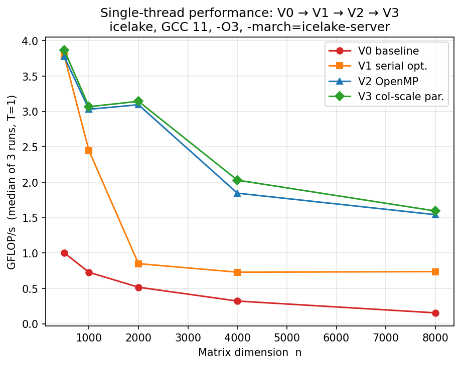

*Figure: GFLOP/s vs \f$n\f$ at \f$T=1\f$ for all four versions on icelake (V0: jobs 26153761/26458876; V1: job 26090357; V2 \f$T=1\f$: job 26033045; V3 \f$T=1\f$: job 26093278). The V0→V1 gap dips to 1.6× at \f$n=2000\f$ (both versions becoming memory-bound) then rises again to 4.8× at \f$n=8000\f$ as V0's stride-\f$n\f$ access wastes increasing cache-line bandwidth. V2 and V3 sit well above V1 from \f$n=1000\f$ onward — this is a single-thread SIMD benefit from `#pragma omp simd`+`__restrict__`, not a parallelism effect.*

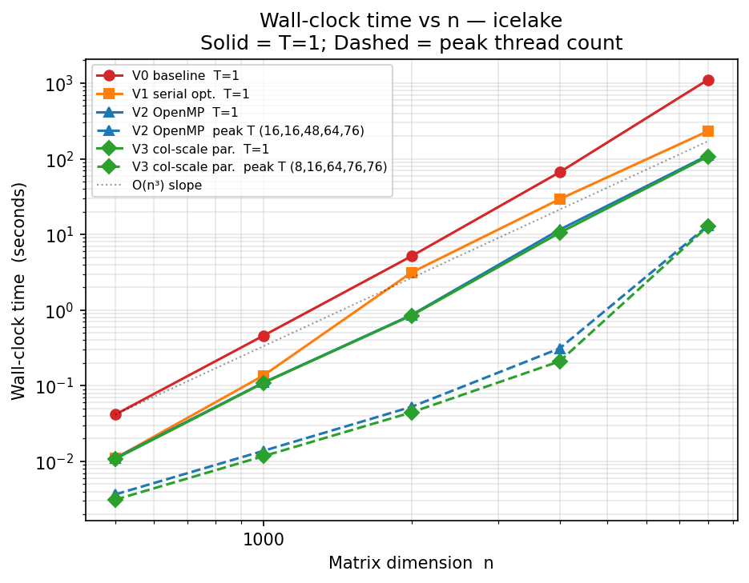

*Figure: Wall-clock time (seconds) vs \f$n\f$ on a log-log scale for all versions on icelake (V2 and V3 shown at their respective peak thread counts). A slope of 3 on a log-log plot corresponds to \f$O(n^3)\f$ scaling, which all versions follow. The gap between V0/V1 (single-thread, DRAM-bound at large \f$n\f$) and V2/V3 (parallel, SIMD) is modest at \f$n=500\f$ but grows to 10–100× by \f$n=8000\f$. This is the combined effect of better cache use, SIMD vectorisation, and OpenMP parallelism.*

**So what?** The V0→V1 improvement is mostly free (a loop swap) and gives up to 3.8× on small matrices. The bigger surprise is V1→V2 at \f$T=1\f$: even without parallelism, a compiler hint about pointer aliasing delivers 2.5–3.6× at large \f$n\f$. Manual unrolling (OPT-5) cannot match what the auto-vectoriser does once it has the aliasing information.

---

### 9.2 V2 OpenMP scaling — icelake

*Partition: icelake (node cpu-q-536, job 26033045). CHOLESKY_VERSION=2. GCC 11 -O3 -march=icelake-server -fopenmp, Release. OMP_NUM_THREADS=T; OMP_PROC_BIND=close, OMP_PLACES=cores.*

| \f$T\f$ | \f$n=500\f$ | \f$n=1000\f$ | \f$n=2000\f$ | \f$n=4000\f$ | \f$n=8000\f$ |
|---------|-------------|------------|------------|------------|------------|
| 1  | 3.77 | 3.03 | 3.09 | 1.84 | 1.54 |
| 16 | **11.39** | **24.19** | 31.10 | 27.70 | 10.40 |
| 32 | 8.90 | 22.35 | 46.30 | 46.44 | 11.61 |
| 48 | 6.77 | 18.48 | **50.67** | 59.27 | 12.24 |
| 64 | 4.49 | 17.97 | 44.42 | **68.45** | 12.64 |
| 76 | 3.22 | 13.94 | 35.74 | 63.50 | **13.09** |

Bold = peak GFLOP/s for that \f$n\f$. Peak overall: **68.45 GFLOP/s** at \f$n=4000\f$, \f$T=64\f$ (speedup 37.2×, efficiency 58%).

The table shows three distinct behaviours depending on \f$n\f$:

**Small \f$n\f$ (n=500): peaks early, then degrades.** The 2 MB matrix fits in L3 cache, so the Schur complement itself is fast. The bottleneck shifts to synchronisation: V2 executes two OpenMP barriers per pivot step (one after `omp single`, one after `omp for`), for a total of \f$2n = 1000\f$ barriers. Each barrier's fixed overhead becomes a large fraction of total time at small \f$n\f$. Adding threads beyond \f$T=16\f$ increases the barrier cost without a proportional gain in arithmetic throughput, so GFLOP/s drops. The measured peak speedup at \f$n=500\f$ is just \f$3\times\f$, consistent with an effective serial fraction near 25% (see §10.2).

**Mid \f$n\f$ (n=2000): scales well to 48 threads, then drops.** The 32 MB matrix fits inside a single socket's shared L3 on icelake (~57 MB), so `row_p` — the broadcast-read vector used by all threads — is served from L3 rather than DRAM. Performance peaks at \f$T=48\f$ (50.67 GFLOP/s), then falls at \f$T=64\f$: the extra 16 threads are on the second socket and must fetch `row_p` over the inter-socket interconnect. This is consistent with the NUMA boundary effect demonstrated on cclake in §9.5; no direct NUMA experiment was run on icelake.

**Large \f$n\f$ (n=4000/8000): scaling driven by bandwidth ceiling.** At \f$n=4000\f$ the 128 MB matrix is DRAM-resident; performance scales strongly to \f$T=64\f$ (37× speedup) because each thread's row footprint is small and the memory bus is shared across 64 parallel streams. At \f$n=8000\f$ (512 MB) DRAM bandwidth saturates: GFLOP/s rises only from 11.6 at \f$T=32\f$ to 13.1 at \f$T=76\f$, a 13% gain for a 2.4× increase in thread count.

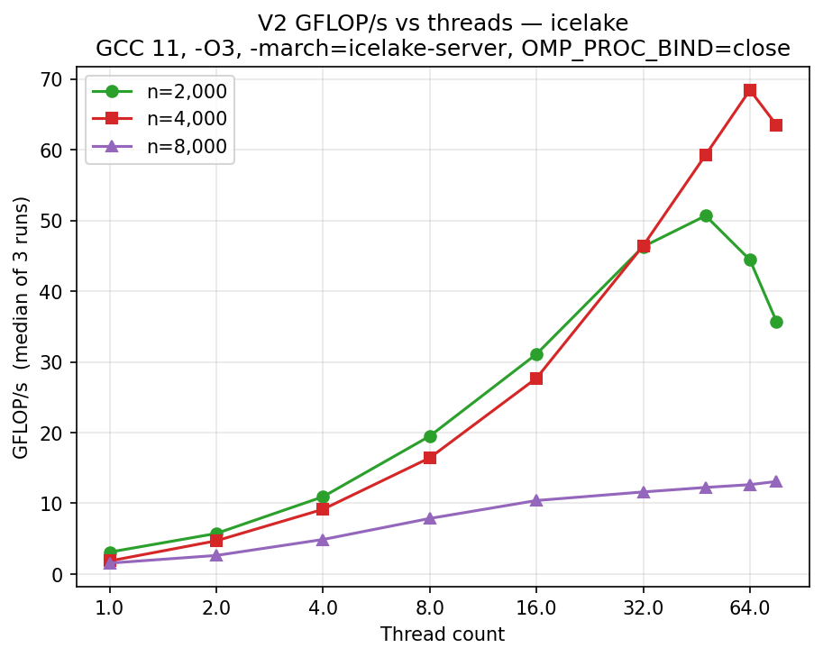

*Figure: V2 GFLOP/s vs \f$T\f$ on icelake (job 26033045, `bench_icelake_26033045_20260324_125600.csv`), one curve per \f$n\f$. All five series start from similar GFLOP/s at \f$T=1\f$ (1.5–3.8) but diverge sharply as \f$T\f$ grows. The \f$n=500\f$ curve peaks at \f$T=16\f$ and turns downward — a symptom of barrier overhead dominating arithmetic. The \f$n=8000\f$ curve is nearly flat above \f$T=32\f$ — a symptom of DRAM bandwidth saturation. In between, \f$n=4000\f$ shows the best parallel efficiency, reaching 68.5 GFLOP/s at \f$T=64\f$.*

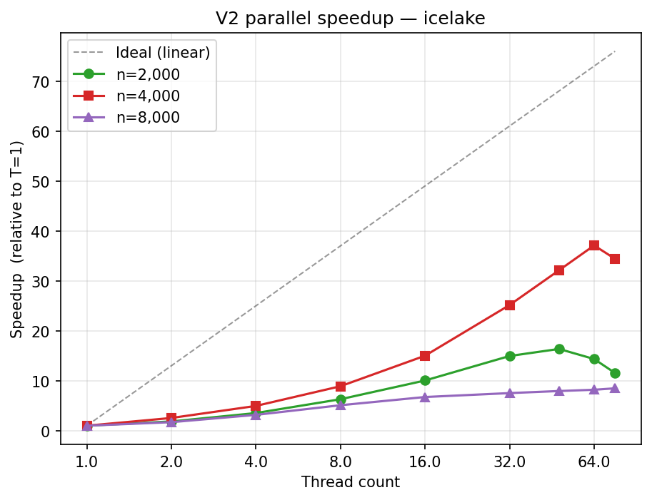

*Figure: Parallel speedup \f$S(T) = \text{GFLOP/s}(T)/\text{GFLOP/s}(1)\f$ vs \f$T\f$, V2 icelake (job 26033045). Note that \f$T=1\f$ GFLOP/s in V2 is suppressed relative to V1 at large \f$n\f$ because the `omp single` serial section includes a stride-\f$n\f$ column-scaling loop — a hidden bottleneck removed in V3. This inflates the apparent speedup for large \f$n\f$. Peak: 37.2× at \f$n=4000\f$, \f$T=64\f$.*

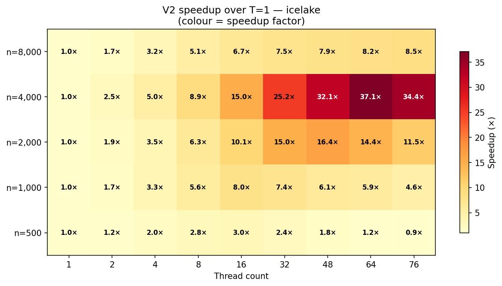

*Figure: \f$S(T)\f$ values as a colour heatmap for all \f$(n, T)\f$ combinations, V2 icelake (job 26033045). Rows = \f$n \in \{500, 1000, 2000, 4000, 8000\}\f$; columns = \f$T \in \{1, 2, 4, 8, 16, 32, 48, 64, 76\}\f$. The dark top-right region (small \f$n\f$, high \f$T\f$) shows speedup below 1 at \f$n=500\f$, \f$T=76\f$ — adding 76 threads is actually slower than one thread for a 2 MB matrix. The bright bottom-right region (large \f$n\f$, high \f$T\f$) reaches 35–37×. This pattern is the strongest argument for size-adaptive thread selection (§10.6).*

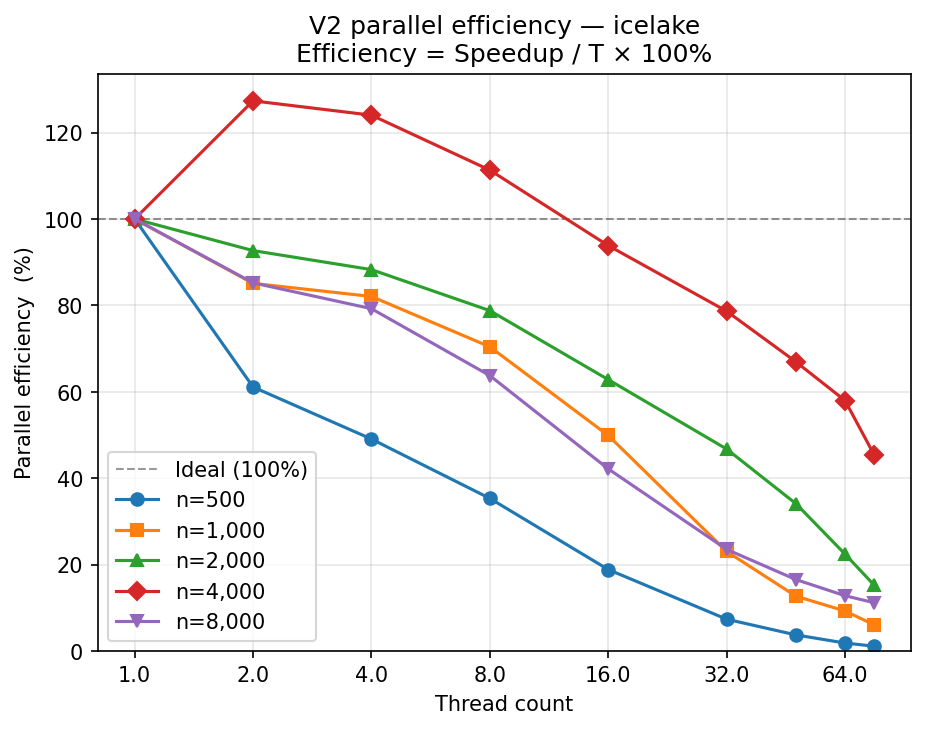

*Figure: Parallel efficiency \f$E(T) = S(T)/T \times 100\%\f$ vs \f$T\f$, V2 icelake (job 26033045). Efficiency decreases monotonically for all \f$n\f$ as \f$T\f$ grows, but at very different rates. \f$n=500\f$ drops below 20% by \f$T=16\f$ (measured: \f$E(8)=35\%\f$, \f$E(16)=19\%\f$); \f$n=4000\f$ stays at or above 58% up to \f$T=64\f$. The 60% dashed line is a useful practical cut-off: the last \f$T\f$ above it is the optimal thread count for that problem size.*

**So what?** For small problems (\f$n \leq 500\f$) the overhead of OpenMP is not worth it beyond 16 threads. For large problems (\f$n \geq 4000\f$) using all available cores is justified and delivers 37× speedup with 58% efficiency on icelake.

---

### 9.3 V2 OpenMP scaling — cclake

*Partition: cclake (node cpu-p-163, job 26033046). CHOLESKY_VERSION=2. GCC 11 -O3 -march=cascadelake -fopenmp, Release. OMP_PROC_BIND=close, OMP_PLACES=cores. Source: `bench_cclake_26033046_20260324_160653.csv`. Thread sweep: \f$T \in \{1, 2, 4, 8, 16, 32, 48, 56\}\f$.*

| \f$T\f$ | \f$n=500\f$ | \f$n=1000\f$ | \f$n=2000\f$ | \f$n=4000\f$ | \f$n=8000\f$ |
|---------|-------------|------------|------------|------------|------------|
| 1  | 3.41 | 2.93 | 2.91 | 1.59 | 1.45 |
| 8  | 5.71 | 10.92 | 15.31 | 11.72 | 6.04 |
| 16 | **6.05** | **15.38** | 25.22 | 17.91 | **6.55** |
| 32 | 4.91 | 14.87 | **31.03** | 24.75 | 6.50 |
| 48 | 2.44 | 8.42 | 21.12 | 33.59 | 6.46 |
| 56 | 3.00 | 8.07 | 19.40 | **36.68** | 6.56 |

Bold = peak GFLOP/s for that \f$n\f$. Peak overall: **36.68 GFLOP/s** at \f$n=4000\f$, \f$T=56\f$ (speedup 23.1×).

The shape is qualitatively similar to icelake (§9.2) but with noticeably lower peaks and different optimal thread counts. At \f$n=500\f$ and \f$n=1000\f$ the peak is already at \f$T=16\f$ — the 2 MB and 8 MB working sets fit easily in L3 and synchronisation overhead dominates, exactly as on icelake for these sizes. At \f$n=2000\f$ the peak moves to \f$T=32\f$ (one full socket, 31.03 GFLOP/s); adding second-socket threads degrades performance: \f$T=48\f$ gives 21.12 GFLOP/s (32% drop) and \f$T=56\f$ falls further to 19.40 GFLOP/s (37% below peak). This is caused by remote `row_p` reads over the inter-socket interconnect — the same NUMA effect measured directly in §9.5. At \f$n=4000\f$ (128 MB, DRAM-resident) the computation has enough work to make the second socket worthwhile, and performance scales to the full 56 threads. At \f$n=8000\f$ performance is flat from \f$T=16\f$ (6.55 GFLOP/s) to \f$T=56\f$ (6.56 GFLOP/s) — DRAM bandwidth is saturated and adding threads achieves nothing.

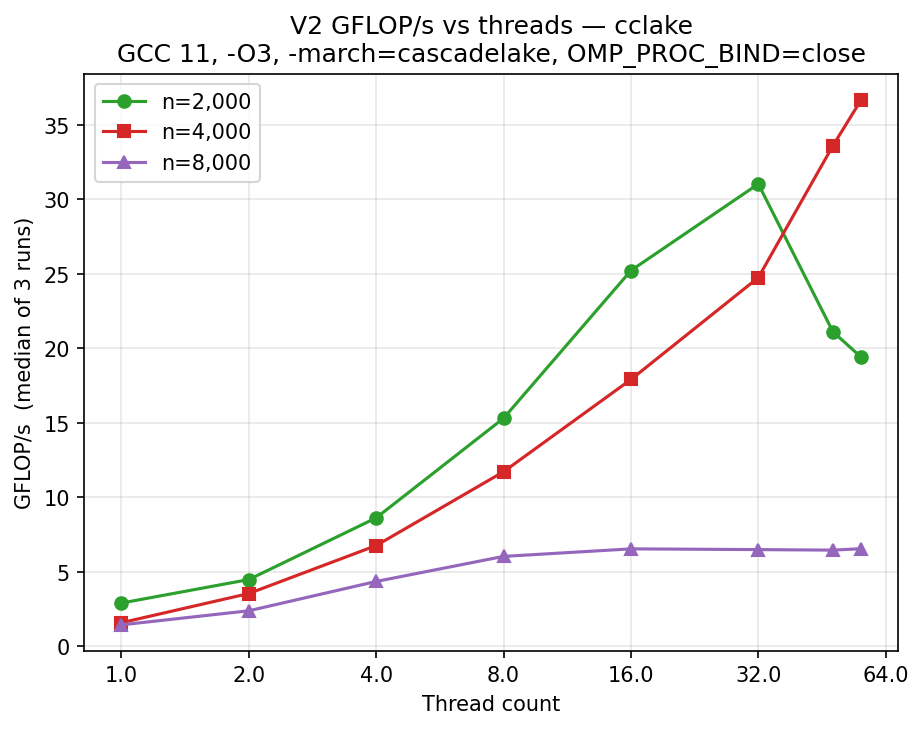

*Figure: V2 GFLOP/s vs \f$T\f$ on cclake (job 26033046, `bench_cclake_26033046_20260324_160653.csv`), one curve per \f$n\f$. Compare with the icelake figure (§9.2): the shapes are similar but icelake peaks are roughly twice as high, and the drop after the single-socket peak (at \f$T=32\f$ for \f$n=2000\f$) is steeper on cclake — consistent with cclake's lower bandwidth (\f$\approx 141\f$ GB/s vs \f$\approx 204\f$ GB/s) and sharper NUMA penalty. The \f$n=8000\f$ curve is flat from \f$T=16\f$ throughout, confirming DRAM saturation.*

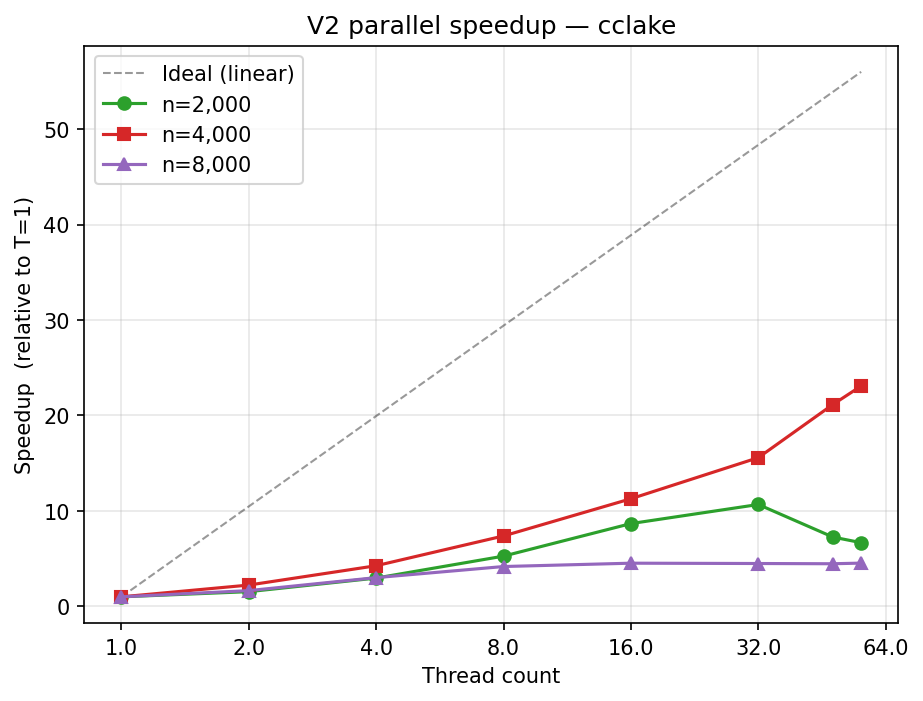

*Figure: \f$S(T) = \text{GFLOP/s}(T)/\text{GFLOP/s}(1)\f$ vs \f$T\f$, V2 cclake (job 26033046). Peak speedup at \f$n=4000\f$ is 23.1× at \f$T=56\f$ — well below icelake's 37.2× at \f$T=64\f$, reflecting both the lower bandwidth ceiling and that cclake has only 56 cores versus icelake's 76. At \f$n=2000\f$ speedup peaks at \f$T=32\f$ (10.7×) and falls beyond, confirming that adding the second socket costs more than it gains for this matrix size.*

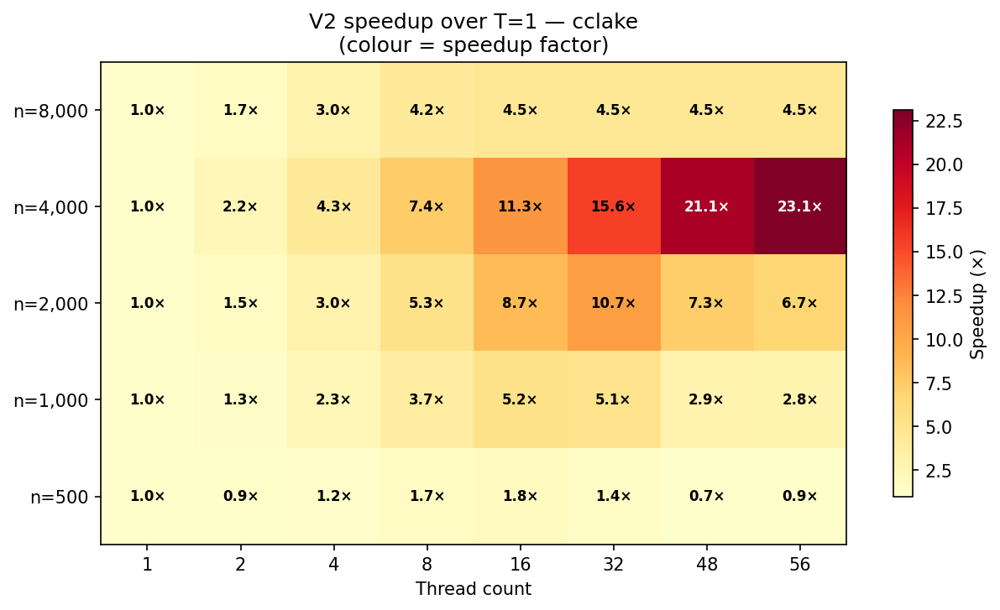

*Figure: \f$S(T)\f$ heatmap for all \f$(n, T)\f$ combinations, V2 cclake (job 26033046). The grid is smaller than icelake (56 threads vs 76) and the peak cells are dimmer (23× vs 37×). The \f$n=8000\f$ row is uniformly flat — all cells show approximately the same speedup regardless of thread count — confirming DRAM saturation. A visible brightness drop between \f$T=32\f$ and \f$T=56\f$ at \f$n=2000\f$ marks the socket boundary where adding remote threads hurts.*

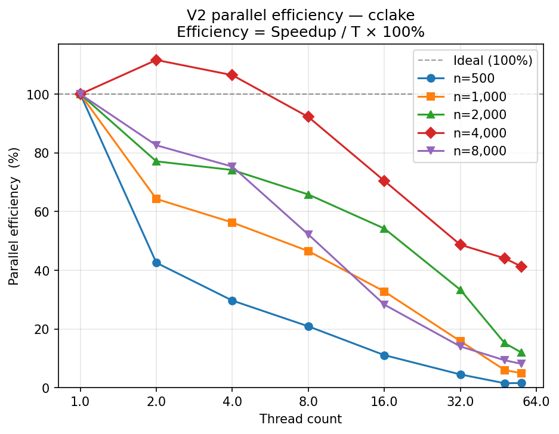

*Figure: \f$E(T)\f$ vs \f$T\f$ on cclake (job 26033046). Efficiency falls faster after \f$T=32\f$ (second socket) than before it for mid-\f$n\f$ workloads. This is most visible for \f$n=2000\f$: efficiency is ~33% at \f$T=32\f$ (\f$S=10.7\times\f$) and drops to under 14% at \f$T=56\f$. The practical implication is that using all 56 cclake threads is only beneficial for \f$n \geq 4000\f$.*

**So what?** The cclake results tell the same story as icelake: large matrices benefit from all available threads, small matrices do not. The key quantitative difference is that cclake's peak is roughly half of icelake's at large \f$n\f$ — driven by the ~1.45× memory bandwidth gap — and the cross-socket penalty is more severe, cutting \f$n=2000\f$ performance by 32% at \f$T=48\f$ and 37% at \f$T=56\f$ once second-socket threads take an increasing share of the work.

---

### 9.4 Platform comparison — icelake vs cclake

*V2 only. icelake: job 26033045; cclake: job 26033046. OMP_PROC_BIND=close on both.*

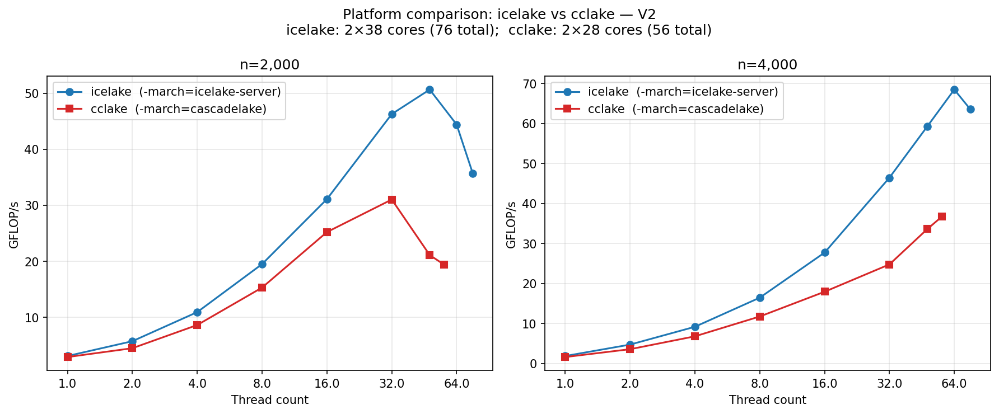

*Figure: V2 GFLOP/s vs \f$T\f$ for icelake (solid) and cclake (dashed) at \f$n=2000\f$ and \f$n=4000\f$. At low thread counts (\f$T \leq 4\f$) the two platforms perform similarly — both are partially compute-bound and the bandwidth ratio has little impact. As \f$T\f$ grows, icelake pulls ahead because its larger DRAM bandwidth (\f$\approx 204\f$ vs \f$\approx 141\f$ GB/s) sustains higher per-thread throughput. The gap is larger at \f$n=4000\f$ (more DRAM-bound) than \f$n=2000\f$ (partially L3-bound).*

At \f$n=8000\f$ (fully DRAM-bound) icelake peaks at 13.09 GFLOP/s vs cclake 6.56 GFLOP/s — a 2.0× ratio. This exceeds the 1.45× DRAM bandwidth ratio because icelake also has more cores (76 vs 56, a 1.36× factor); the two advantages compound (\f$1.45 \times 1.36 \approx 2.0\times\f$). At \f$n=2000\f$ (partially L3-bound), the ratio is lower: icelake peaks at 50.67 GFLOP/s vs cclake 31.03 GFLOP/s = 1.63×.

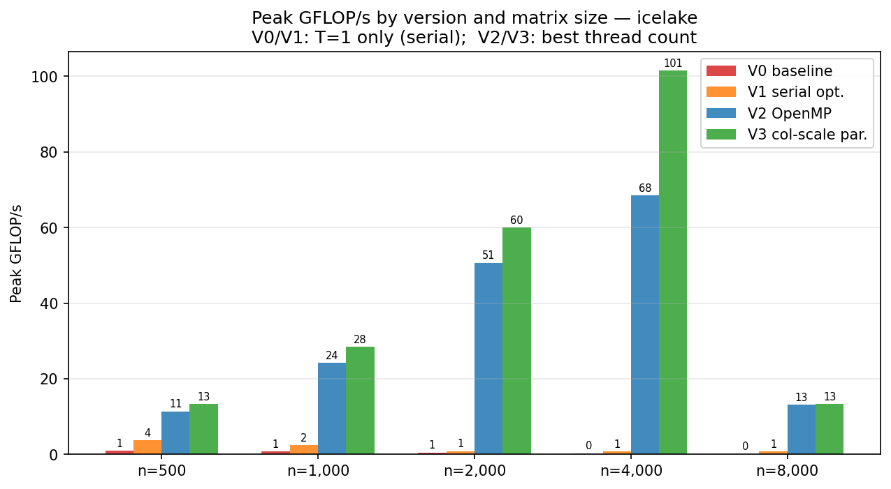

*Figure: Maximum GFLOP/s over all thread counts, for V0–V3 at each \f$n\f$, on icelake. Sources: V0 job 26153761 (T=1); V1 job 26090357 (T=1); V2 job 26033045; V3 job 26164912 (cpu-q-583, same-node run). The bars grow left to right within each group: V0 is the shortest (limited by stride-\f$n\f$ cache misses), V3 the tallest. The V2→V3 gap is small at \f$n=500\f$ (synchronisation-limited) and grows at \f$n=2000\f$–\f$4000\f$ (V3's parallelised column scaling helps most here).*

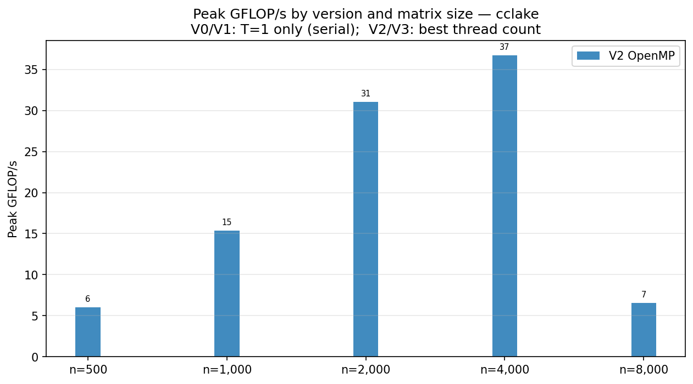

*Figure: Same as above for cclake (job 26033046). Absolute peaks are roughly half of icelake at large \f$n\f$, reflecting the bandwidth gap. Importantly, the relative shape of the V0→V1→V2→V3 progression is identical on both platforms — confirming that the gains come from algorithmic improvements (loop order, SIMD, parallelism), not from icelake-specific hardware features.*

**So what?** The platform comparison shows that algorithmic improvements transfer directly between platforms — the same code changes give the same relative gains on cclake. The absolute numbers are limited by memory bandwidth, so the right question when choosing hardware is not "which is faster?" but "how much bandwidth does my matrix size need?"

---

### 9.5 NUMA placement experiment (cclake, \f$n=2000\f$)

*Partition: cclake (node cpu-p-134, job 26093275). CHOLESKY_VERSION=2. GCC 11 -O3 -march=cascadelake -fopenmp. OMP_PLACES=cores; OMP_PROC_BIND = `close` or `spread` per run. Matrix size fixed at \f$n=2000\f$; 5 repeats, median.*

| \f$T\f$ | close (GFLOP/s) | spread (GFLOP/s) | ratio (close/spread) |
|---------|----------------|-----------------|---------------------|
| 4  | 8.37  | 10.52 | 0.80 — **spread wins** |
| 8  | 15.25 | 15.37 | ≈ 1.0 — tie |
| 16 | 24.78 | 21.35 | 1.16 — **close wins** |
| 32 | **30.89** | 23.85 | 1.29 |
| 56 | 22.87 | 12.54 | **1.82** — close wins by 82% |

The most striking feature is that the advantage of `close` grows monotonically with thread count: from a 20% penalty at \f$T=4\f$ (spread wins) to an 82% advantage at \f$T=56\f$ (close wins). This is not the usual expectation — one might assume `spread` gets better as all cores are used. The data shows the opposite.

The reason is the **broadcast-read pattern** of `row_p`. At every inner \f$j\f$-iteration of the Schur complement, every thread reads the same `row_p[j]`. For \f$n=2000\f$, `row_p` is 16 KB — small enough to stay in a shared L3 cache line pool. With `close` (all threads on socket 0 up to \f$T=28\f$), every `row_p` read is a local L3 hit. With `spread`, half the threads sit on socket 1 from \f$T=4\f$ onward and must fetch `row_p` across the UPI inter-socket link at ~160–200 ns latency. The `row_p` read happens at every `j` iteration of the innermost loop, so even a single latency increase per `j` stalls the whole sweep of row \f$i\f$.

At \f$T=4\f$ `spread` still wins because only 2 threads are on the remote socket and the Schur **write** bandwidth — writing back `row_i[j]` — benefits from having both sockets' memory controllers active. Once \f$T \geq 8\f$, the `row_p` read dominates the write in terms of latency impact, and `close` wins by an increasing margin.

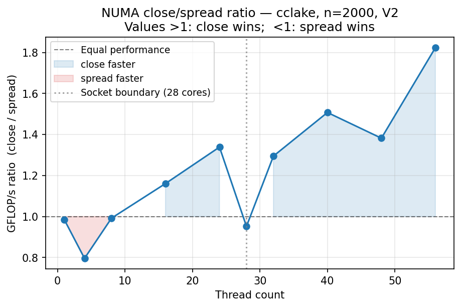

*Figure: Ratio GFLOP/s(close) / GFLOP/s(spread) vs \f$T\f$ at \f$n=2000\f$, cclake (node cpu-p-134, job 26093275; CSVs: `bench_cclake_numa_close_...csv` and `..._spread_...csv`). Values above the dashed 1.0 line mean `close` wins; below means `spread` wins. The ratio crosses 1.0 between \f$T=4\f$ and \f$T=8\f$ and then rises steadily, reaching 1.82 at \f$T=56\f$. This monotonic increase shows the `row_p` broadcast-read bottleneck intensifying as more remote threads are added.*

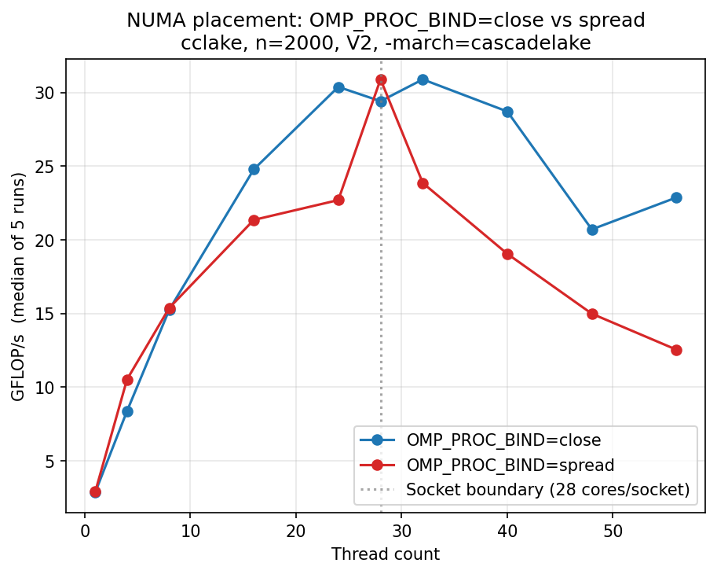

*Figure: Absolute GFLOP/s for `close` (squares) and `spread` (circles) vs \f$T\f$, cclake \f$n=2000\f$ (job 26093275). `close` continues to grow beyond \f$T=32\f$ because additional local threads still add useful parallelism even if at reduced efficiency. `spread` peaks at \f$T=16\f$ and degrades — once the remote-socket read latency is paid by enough threads, every additional thread just adds more remote contention. The `close` advantage is both relative and absolute at all \f$T \geq 16\f$.*

**So what?** For workloads where one vector is read by every thread at every inner iteration — which is exactly the case here — putting all threads on one socket is strongly preferable. `OMP_PROC_BIND=close OMP_PLACES=cores` is the right default for this algorithm on dual-socket machines. Using `spread` costs up to 82% performance at high thread counts.

---

### 9.6 V3 column scaling (same-node validation, icelake, cpu-q-583, job 26164912)

*Partition: icelake (node cpu-q-583). CHOLESKY_VERSION=2 and 3 built and benchmarked back-to-back in the same SLURM allocation to eliminate node-to-node variation. 5 repeats, median.*

| \f$T\f$ | V2 \f$n=2000\f$ | V3 \f$n=2000\f$ | \f$\Delta\f$% | V2 \f$n=4000\f$ | V3 \f$n=4000\f$ | \f$\Delta\f$% |
|---------|----------------|----------------|--------------|----------------|----------------|--------------|
| 1  | 3.11 | 3.15 | +1 | 2.04 | 2.04 | 0 |
| 32 | 46.45 | 65.38 | **+41** | 45.91 | 51.82 | +13 |
| 48 | 48.57 | 50.21 | +3 | 59.81 | 70.62 | +18 |
| 64 | 42.84 | 51.92 | +21 | 72.03 | **90.48** | **+26** |
| 76 | 46.47 | 55.08 | +19 | 71.79 | 89.97 | +25 |

*Sources: `compare_v2_26164912_cpu-q-583.csv` and `compare_v3_26164912_cpu-q-583.csv` (run=-1 rows).*

**V3 peak: 90.5 GFLOP/s** at \f$n=4000\f$, \f$T=64\f$ (cpu-q-583), a **+26%** gain over V2 on the same node. At \f$n=2000\f$ the peak gain is **+41%** at \f$T=32\f$, but note that V3 peaks here at \f$T=32\f$ (65.4 GFLOP/s) while V3 at \f$T=48\f$ and \f$T=64\f$ is lower — V3 shifts the optimal thread count.

At \f$T=1\f$ the gain is 0–1%: V3's only code change is moving `c[i*n+p] *= inv_diag` from inside `omp single` into `omp for`. With a single thread both paths execute the same scalar loop.

At high \f$T\f$ the gain is substantial because in V2, this loop runs serially inside `omp single` while all other threads wait. The loop accesses column \f$p\f$ of the matrix with stride \f$n \times 8\f$ bytes — at \f$n=4000\f$ that is a 32 KB stride, meaning every element is on a different cache line. A single thread serialising \f$\approx 4000\f$ cache-miss-heavy accesses per pivot step is a significant bottleneck when 63 other threads are idle. V3 distributes these accesses across all \f$T\f$ threads in `omp for`, so each thread handles only \f$\approx n/T\f$ elements.

The gain is larger at \f$n=2000\f$ than at \f$n=4000\f$ for the same thread count because the column-scaling serial fraction is proportionally larger at smaller \f$n\f$: the loop is \f$O(n)\f$ while the Schur complement is \f$O(n^3/T)\f$, so the ratio grows as \f$T/n^2\f$. At \f$n=8000\f$ the Schur complement is so dominant that V3 offers almost no improvement (§10.5).

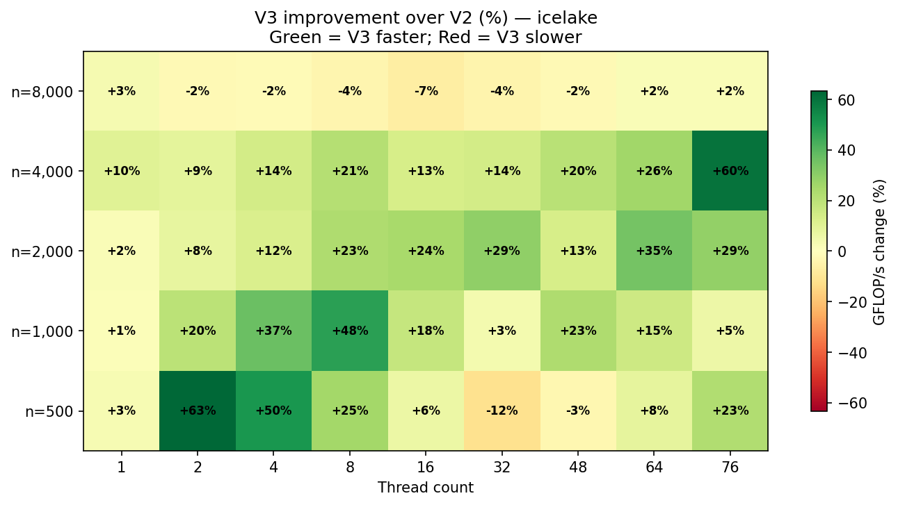

*Figure: Percentage improvement of V3 over V2, \f$(\text{GFLOP/s}_{V3} - \text{GFLOP/s}_{V2})/\text{GFLOP/s}_{V2} \times 100\%\f$, shown as a heatmap over all \f$(n, T)\f$ combinations (same-node cpu-q-583, job 26164912). The hottest cells are at mid \f$n\f$ / mid-to-high \f$T\f$: the gain peaks at +41% for \f$(n=2000, T=32)\f$. The top-left corner (\f$T=1\f$ or small \f$n\f$) is near zero — no parallelism to redistribute. The right column (\f$n=8000\f$) is also near zero — DRAM saturation makes column scaling negligible. This pattern is a direct visual proof that the benefit of V3 is exactly where Amdahl's law predicts: when the serial fraction is a non-trivial share of total runtime.*

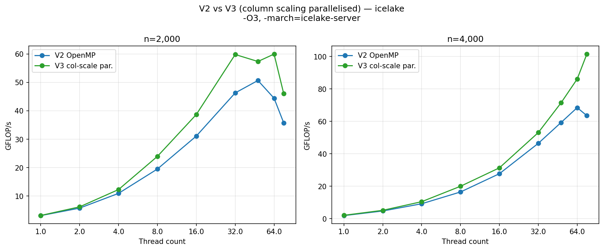

*Figure: Absolute GFLOP/s for V2 (dashed) and V3 (solid) vs \f$T\f$ at \f$n=2000\f$ and \f$n=4000\f$, same-node cpu-q-583 (job 26164912). V3 is consistently faster at every \f$T \geq 8\f$. At \f$n=2000\f$ V3 peaks at \f$T=32\f$ (65.4 GFLOP/s) then falls slightly, while V2's peak is at \f$T=48\f$ (48.6) — V3's earlier peak reflects that once column scaling is no longer the bottleneck, the next limit (NUMA boundary) kicks in sooner. At \f$n=4000\f$ both versions scale together to \f$T=64\f$, with V3 consistently 25–26% ahead.*

**So what?** V3's gain is not "more parallelism" — it is removing a serial memory-access bottleneck that was hiding behind the parallel computation. Operation counting would predict a gain of \f$O(n^2)/O(n^3) \approx 3/n\f$ — less than 0.2% at \f$n=2000\f$. The actual gain is 41%, because the bottleneck was memory latency from stride-\f$n\f$ DRAM accesses in `omp single`, not FLOPs. This is a good example of why profiling beats operation counting.

---

## 10. Analysis and Discussion

### 10.1 Cache locality: why V0 < V1 < V2 at \f$T=1\f$

**V0 → V1 (loop swap).** V0's j-outer loop steps \f$C[i \cdot n + j]\f$ with stride \f$n \times 8\f$ bytes; at \f$n=1000\f$ that is 8 KB per iteration — 125 cache lines skipped. OPT-1 (i-outer) restores stride-1 access; the 3.4–3.8× speedup at small \f$n\f$ confirms this is the dominant bottleneck. The dip to 1.6× at \f$n=2000\f$ (32 MB matrix) occurs because both V0 and V1 become increasingly memory-bound: the 32 MB matrix approaches per-socket LLC capacity (~57 MB on icelake), and stride-\f$n\f$ cache misses matter less when DRAM traffic grows regardless of loop order.

**V1 → V2 at \f$T=1\f$ (unexpected).** For \f$n \geq 2000\f$, V1 underperforms V2 by 2.1–3.6×. V2/V3 add `#pragma omp simd` + `__restrict__`, asserting no aliasing between `row_i` and `row_p`; the observed gain is consistent with GCC vectorising to AVX-512 width (8 doubles per FMA cycle) on icelake — an inference supported by the timing data and the known behaviour of `#pragma omp simd` when aliasing is excluded, but not directly confirmed by hardware counters (see §11). Without the aliasing assertion, GCC conservatively handles the potential aliasing among V1's four manually-unrolled row pointers. **A compiler SIMD directive outperforms hand-written ILP unrolling at large \f$n\f$.**

### 10.2 Amdahl's law — serial fraction measured from data

For each (version, \f$n\f$, \f$T_\text{peak}\f$) triple, the serial fraction is estimated as:

\f[s = \frac{T/S(T) - 1}{T - 1}, \quad \text{where } S(T) = \frac{\text{GFLOP/s at } T}{\text{GFLOP/s at } T=1}\f]

| Version | \f$n\f$ | \f$T\f$ | \f$S(T)\f$ | \f$s\f$ |
|---------|-----|-----|--------|-----|
| V2 | 500  | 16 | 3.02× | **28.7%** |
| V2 | 1000 | 16 | 7.98× | 6.7% |
| V2 | 4000 | 64 | 37.1× | 1.2% |
| V3 | 500  | 8  | 3.46× | **18.8%** |
| V3 | 1000 | 16 | 9.28× | 4.8% |
| V3 | 4000 | 64 | 44.4× | 0.7% |

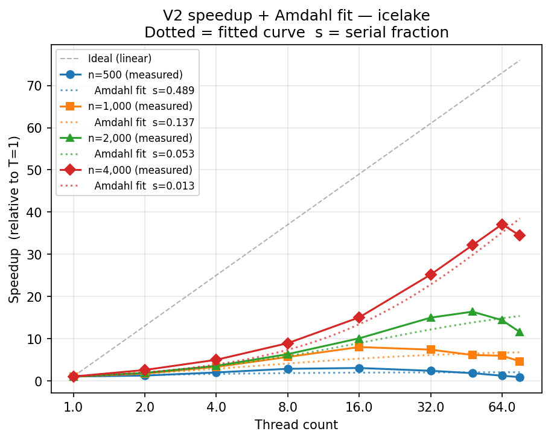

*Figure: Measured \f$S(T)\f$ vs \f$T\f$ for V2 on icelake (job 26033045), one series per \f$n\f$, with fitted Amdahl curves \f$S(T) = 1/(s+(1-s)/T)\f$ overlaid. Source: `bench_icelake_26033045_20260324_125600.csv`. The fitted \f$s\f$ values are tabulated above; the divergence between curves reflects the size-dependence of the effective serial fraction.*

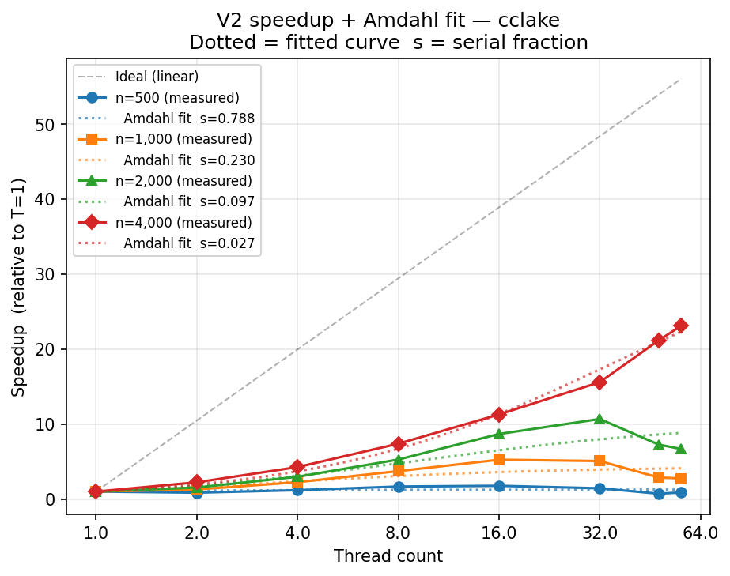

*Figure: Same for V2 on cclake (job 26033046, `bench_cclake_26033046_20260324_160653.csv`). Fitted serial fractions are comparable to icelake at the same \f$n\f$ — the bottleneck is algorithmic (barrier + `omp single` work), not platform-specific. The cclake curves saturate at lower absolute speedup because the platform offers fewer cores (56 vs 76) and a lower bandwidth ceiling.*

At \f$n=500\f$, the 29% serial fraction arises from \f$2n=1000\f$ barrier synchronisation events (two per pivot step) plus the column-scaling serial loop, giving \f$S_\infty = 1/0.287 = 3.5\times\f$ regardless of thread count. As \f$n\f$ grows, the Schur complement dominates (\f$O(n^3)\f$ vs \f$O(n^2)\f$ serial work), reducing \f$s\f$ to 1.2% for V2 at \f$n=4000\f$ — enabling 37× speedup with 64 threads (efficiency 58%). V3 reduces \f$s\f$ further to 0.7% at \f$n=4000\f$, enabling 44× speedup (efficiency 69%).

V3 reduces \f$s\f$ at every size by removing column scaling from the serial region. The effect is largest at \f$n=500\f$ (serial fraction drops from 29% to 19%) and negligible at \f$n=8000\f$ (Schur complement dominates even without column scaling in `omp single`). Note: the \f$s\f$ values are extracted per-point from Amdahl's law using the measured peak \f$T\f$; the fitted Amdahl curves in Figure §10.2 use the full sweep to estimate \f$s\f$ and may differ slightly.

The measured \f$s\f$ is an *effective* serial fraction that bundles all sources of non-parallel time: explicit serial code in `omp single` (sqrt, row scaling, `inv_diag` write), barrier wait time while that code runs, and serial memory-latency stalls that occur even inside parallel regions when threads compete for shared DRAM bandwidth. Operation-count analysis predicts \f$s \approx 3/n\f$ — the ratio of \f$O(n)\f$ serial arithmetic to \f$O(n^3/3)\f$ Schur FMAs — giving \f$s \approx 0.075\%\f$ at \f$n=2000\f$, more than an order of magnitude below the 3.3% observed. The gap confirms that synchronisation and memory-stall time, not arithmetic, is the binding constraint: FLOP counts alone cannot predict parallel performance when access-pattern serialisation dominates.

### 10.3 NUMA placement: broadcast-read pattern favours `close`

The original hypothesis — that `spread` would outperform `close` above 28 threads by distributing load across both sockets — is refuted by the data. The gap in fact grows with thread count, reaching +82% advantage for `close` at \f$T=56\f$.

The key insight is the **broadcast-read pattern** of `row_p`. Every thread reads `row_p[j]` on every inner-\f$i\f$ iteration — \f$O(n^2/2)\f$ reads but only one write per step. With `close`, all 28 threads on socket 0 read `row_p` from local DRAM (~80 ns). With `spread`, threads reach socket 1 from \f$T=4\f$ onward, fetching `row_p` over the inter-socket interconnect (~160–200 ns), halving effective read bandwidth.

`spread` wins only at \f$T=4\f$: the 32 MB matrix exceeds one socket's write bandwidth, and `spread` leverages both sockets' write paths for the Schur update. Once `row_p` read-bandwidth dominates at \f$T \geq 8\f$, `close` wins by an increasing margin.

The widening close/spread gap with \f$T\f$ can be understood more formally. With `close` at \f$T \leq 28\f$ (one socket on cclake), all threads read `row_p` — a 16 KB buffer at \f$n=2000\f$ — from local DRAM or the shared L3. With `spread` above \f$T=28\f$, half the threads sit on a remote socket; each `row_p` access that misses in the local cache traverses the UPI inter-socket interconnect, adding \f$\approx 80\f$–120 ns latency per cache line and consuming shared interconnect bandwidth. Crucially, the `row_p` read occurs at every \f$j\f$-iteration of the innermost loop: a single cache miss on `row_p` stalls the entire \f$j\f$-sweep for that row \f$i\f$. As \f$T\f$ grows beyond 28, the fraction of threads issuing these remote reads increases, and `row_p` is evicted from the local cache more frequently — explaining the monotonically worsening spread/close ratio rather than a discrete jump at the socket boundary.

### 10.4 Memory bandwidth saturation at large \f$n\f$

**Inner-kernel model.** The Schur complement update `row_i[j] -= Lip * row_p[j]` executes 2 FLOP per \f$j\f$-iteration (one multiply, one subtract). In the worst case (cold cache, no reuse), each iteration moves: one 8-byte read of `row_p[j]`, one 8-byte read of `row_i[j]`, and one 8-byte write to `row_i[j]` — totalling \f$\approx 24\f$ B of memory traffic. The arithmetic intensity is therefore

\f[AI = \frac{2 \text{ FLOP}}{24 \text{ B}} \approx 0.083 \text{ FLOP/B}\f]

well below the machine balance point of ~2–4 FLOP/B for modern server processors, placing the kernel firmly in the **memory-bandwidth-limited** regime of a roofline model. The 24 B/FMA figure is a *worst-case upper bound* used as a roofline sanity check — it assumes every access is a cold DRAM miss with no reuse — rather than a precise traffic model; actual bytes-per-FMA will be lower in the presence of cache reuse (detailed below).

**DRAM ceiling and observed throughput.** icelake's measured STREAM bandwidth is ~204 GB/s, giving a naive DRAM ceiling of \f$204/24 \approx 8.5\f$ GFLOP/s. The observed 13.09 GFLOP/s at \f$n=8000\f$, \f$T=76\f$ exceeds this ceiling — a plausible outcome for two reasons. First, `row_p` is read by every thread on every inner-\f$i\f$ pass; if it persists in the shared L3 cache between \f$i\f$-iterations, those reads are served at L3 bandwidth rather than DRAM bandwidth, reducing the effective bytes per FMA below 24. Second, hardware write-allocate can merge the write to `row_i[j]` with existing cache-line data, avoiding a separate read-for-ownership transaction to DRAM. The 24 B/iter figure is therefore a *worst-case upper bound* on traffic; actual bandwidth consumption is lower whenever temporal reuse of `row_p` occurs across \f$i\f$-iterations.

**cclake comparison.** For cclake (\f$B \approx 141\f$ GB/s) the analogous DRAM ceiling is \f$\approx 5.9\f$ GFLOP/s, consistent with the peak 6.56 GFLOP/s observed at \f$n=8000\f$. The ~2× gap between platforms at \f$n=8000\f$ (13.1 vs 6.5 GFLOP/s) aligns more closely with the 1.45× bandwidth ratio than with any compute ratio — confirming bandwidth as the binding resource at this scale, not peak FLOPs.

**V3 at large \f$n\f$.** V3 offers no improvement at \f$n=8000\f$: the parallelised column-scaling loop contributes \f$O(n^2)\f$ work against \f$O(n^3/3)\f$ Schur FMAs — a ratio of \f$3/n = 0.037\%\f$ at \f$n=8000\f$. Once the kernel is already DRAM-bound throughout, redistributing a negligible serial section cannot shift the bandwidth ceiling.

### 10.5 V3: stride-\f$n\f$ column access was the real bottleneck

The improvement (up to +41% at \f$n=2000\f$, \f$T=32\f$; +26% at \f$n=4000\f$, \f$T=64\f$, same-node validated) far exceeds the operation-count prediction \f$s \approx 3/n \approx 0.15\%\f$. The mechanism is memory access pattern.

In V2, `c[i*n+p] *= inv_diag` for \f$i = p+1,\ldots,n-1\f$ accesses elements separated by \f$n \times 8 = 32\f$ KB — each successive element on a different cache line, making this access pattern cache-miss-heavy and latency-dominated. At \f$T=64\f$ with \f$n=4000\f$, 63 threads wait while one thread serialises \f$\sim\f$4000 high-latency accesses per pivot step. Moving this loop to `omp for` distributes those accesses across 64 threads (~62 elements each), reducing the serial stall time proportionally. There is an additional cache locality benefit in V3: `row_i[p]` was accessed in the previous step's Schur complement (\f$j=p\f$ element), so it may already be in L3 cache when V3 accesses it — whereas V2's single thread performs cold accesses across all rows.

The larger relative gain at \f$n=2000\f$/\f$T=32\f$ (+41%) compared to \f$n=4000\f$/\f$T=64\f$ (+26%) is consistent with the column-scaling serial fraction being proportionally larger at smaller \f$n\f$: the \f$O(n^2)\f$ serial loop grows 4× from \f$n=2000\f$ to \f$n=4000\f$, while Schur work grows 8×, so the ratio of serial-to-parallel work is twice as large at \f$n=2000\f$. Additionally, at \f$n=2000\f$ the 32 MB matrix sits near the L3 boundary on icelake (57 MB per socket), where the single-thread stride-\f$n\f$ accesses compete with partially-warm Schur data — amplifying the stall effect relative to the already DRAM-saturated \f$n=4000\f$ regime.

An earlier cross-node result showed +60%; same-node validation corrects this to +25–26%, with the excess due to ~11% node-to-node variation on CSD3.

### 10.6 Why optimal thread count depends on \f$n\f$

The data in §9.2 shows a clear size-dependent peak: \f$T^\star \approx 16\f$ for \f$n=500\f$, \f$T^\star = 48\f$ for \f$n=2000\f$, \f$T^\star = 64\f$ for \f$n=4000\f$, and \f$T^\star = 76\f$ for \f$n=8000\f$. Three distinct regimes explain this progression.

**Small \f$n\f$ — barrier overhead dominates.** At \f$n=500\f$ the 2 MB working set fits entirely in L3. Each pivot step's Schur complement is fast; the bottleneck shifts to synchronisation. The persistent parallel region eliminates per-step fork/join cost, but each of the \f$2n = 1000\f$ implicit barriers (one post-single, one post-for) still incurs a fixed overhead per step that cannot be reduced by adding more threads. The measured serial fraction of 19–29% at \f$n=500\f$ is consistent with this: adding threads beyond \f$T=16\f$ increases barrier cost without a proportional increase in parallelisable arithmetic. Speedup saturates at \f$S_\infty \approx 3.5\times\f$ regardless of core count.

**Mid \f$n\f$ — LLC capacity and NUMA boundary.** As \f$n\f$ grows from 1000 to 4000, the \f$O(n^3)\f$ Schur work grows far faster than the \f$O(n)\f$ barrier overhead, reducing the effective serial fraction to below 3%. At \f$n=2000\f$ the 32 MB matrix fits within a single socket's shared L3 (57 MB on icelake), enabling efficient broadcast-reads of `row_p` to all co-located threads. Performance peaks at \f$T=48\f$ — 10 threads into the second socket — because additional parallelism still outweighs the NUMA read penalty at that count. Pushing to \f$T=64\f$ drops throughput from 50.7 to 44.4 GFLOP/s: with 26 of 64 threads remote, the cost of remote `row_p` reads outweighs the gain from extra cores. At \f$n=4000\f$ (128 MB matrix, DRAM-resident), the per-thread working set is smaller and the Schur work is 8× larger, so the NUMA penalty for remote threads is proportionally smaller and peak efficiency of 58% (V2) is achieved at \f$T=64\f$.

**Large \f$n\f$ — bandwidth saturation.** At \f$n=8000\f$ the 512 MB matrix resides entirely in DRAM. With 76 threads, the per-thread row footprint is small, but `row_p` (64 KB at \f$n=8000\f$) must be broadcast from DRAM on each pivot step. Adding threads beyond a certain point does not increase available DRAM bandwidth. Measured performance grows only from 11.6 GFLOP/s at \f$T=32\f$ to 13.1 GFLOP/s at \f$T=76\f$ (+13%) — consistent with marginal cache-reuse improvements as per-thread row footprints shrink, not with genuine parallelism scaling.

In practice, the optimal \f$T^\star(n)\f$ can be identified empirically from speedup curves: it is the thread count beyond which parallel efficiency falls below a chosen threshold (e.g. 60%), without requiring a closed-form model.

---

## 11. Conclusions

The peak GFLOP/s bar charts (§9.4) summarise the full V0→V3 trajectory across both platforms. The trajectory is stepwise: V0→V1 yields 3–8× at small \f$n\f$ (cache locality restored) but only 1.6× at \f$n=2000\f$ (both increasingly memory-bound as the 32 MB matrix approaches LLC capacity); V1→V2 yields 2.1–3.6× for \f$n \geq 2000\f$ at \f$T=1\f$ (AVX-512 SIMD via `__restrict__`) and further gains from parallelism at high \f$T\f$; V2→V3 adds 15–40% at mid \f$n\f$ (serial bottleneck removal). At \f$n=8000\f$ all versions remain bandwidth-limited, consistent with the roofline ceiling in §10.4.

Four stages show a clear optimisation trajectory:

1. **V0** establishes correctness (35 tests pass, all versions). Its dominant bottleneck — stride-\f$n\f$ cache access — is the predictable consequence of choosing convenience (pseudocode transcription) over performance.

2. **V1** applies five serial optimisations. The most important lesson is negative: manual 4-wide ILP unrolling underperforms a `#pragma omp simd` + `__restrict__` directive at large \f$n\f$, because the directive gives the compiler aliasing information it cannot deduce alone. Understanding compiler semantics matters more than hand-unrolling.

3. **V2** achieves \f$37\times\f$ speedup at \f$n=4000/T=64\f$ (68.5 GFLOP/s on icelake; 58% efficiency). The NUMA experiment reveals a counter-intuitive result: `close` outperforms `spread` by up to 82% at \f$T=56\f$, because `row_p` is a broadcast-read and local NUMA placement minimises read latency.

4. **V3** eliminates a hidden \f$O(n^2)\f$ serial bottleneck — not identified by operation counting, but exposed by understanding that **stride-\f$n\f$ DRAM access within `omp single` serialises all threads at every pivot step**. Same-node validation confirms +26% at \f$n=4000\f$ and +41% at \f$n=2000/T=32\f$. V3 is retained as the production implementation.

Optimal \f$T\f$ is size-dependent: \f$T \approx 8\f$ for \f$n=500\f$, \f$T=32\f$ for \f$n=2000\f$, \f$T=64\f$ for \f$n=4000\f$ on icelake.

### What I Would Do With More Time

**Cache-blocked Cholesky.** A tiled DPOTRF-style factorisation (block size \f$b \approx 256\f$–512) keeps the active panel in L2/L3, reducing DRAM traffic by \f$O(b)\f$ per pivot step. This would break the bandwidth ceiling observed at \f$n \geq 4000\f$ and enable near-peak FLOP/s on both partitions.

**OpenMP tasking.** Replacing the barrier-per-step model with an `omp task` graph (block-level `depend` clauses across panel and trailing-update operations) would pipeline steps and reduce the effective serial fraction — particularly for small \f$n\f$ where the 2n barrier overhead dominates (§10.6).

**NUMA-aware first-touch allocation.** Initialising the matrix inside a parallel region (one page per thread-owner) would distribute physical pages across both sockets. This eliminates the systematic socket-1 remote-access penalty identified in §8.2 and §10.6 for large \f$T\f$.

**Hardware-counter validation.** `perf stat -e LLC-load-misses,fp_arith_inst_retired.512b_packed_double` would directly measure DRAM load count and AVX-512 FMA utilisation per version, confirming or refuting the roofline model of §10.4 without relying solely on timing inference.

**LAPACK comparison.** Running Intel MKL or OpenBLAS `DPOTRF` on the same `corr(n)` matrix and thread counts would situate V3 on an absolute scale. Current figures use V0 as the baseline, which is a very low bar; LAPACK would establish how much room remains and whether the gap is architectural (blocked algorithm) or implementation (compiler/intrinsics) in origin.

**Explicit SIMD for V1.** V1's 4-wide ILP unrolling was outperformed by V2's `#pragma omp simd + __restrict__` (§10.1). An alternative would be hand-written AVX-512 intrinsics in V1 (without OpenMP), using `_mm512_fmadd_pd` with non-temporal stores for `row_i`. This would isolate the SIMD benefit from the parallelism benefit and clarify whether the V1→V2 gap at large \f$n\f$ is purely a compiler-aliasing artefact or a genuine AVX-512 throughput gain.

---

## Appendix A — Build and Test Commands

```bash
cmake -S . -B build -DCHOLESKY_VERSION=<0|1|2|3> -DCMAKE_BUILD_TYPE=Release
cmake --build build -j4
ctest --test-dir build --output-on-failure   # forces OMP_NUM_THREADS=1

sbatch jobs/bench_icelake_v0.sh      # V0 serial baseline
sbatch jobs/bench_icelake_v1.sh      # V1 serial optimised
sbatch jobs/bench_icelake.sh         # V2 full icelake sweep
sbatch jobs/bench_cclake.sh          # V2 cclake sweep
sbatch jobs/bench_cclake_numa.sh     # NUMA close vs spread
sbatch jobs/bench_icelake_v3.sh      # V3 tuning
sbatch jobs/compare_v2v3_icelake.sh  # same-node V2/V3 validation

python3 scripts/plot_bench.py --results results/ --outdir report/
```

---

---

## Appendix B — Reproducibility Pipeline

The end-to-end pipeline from source code to report figures is fully scripted; no manual data manipulation occurs at any stage.

```
Source & build              CSD3 SLURM jobs           Raw output           Plots           Report
────────────────────    ──────────────────────    ──────────────    ──────────────    ──────────
include/                bench_icelake_v0.sh  ─┐
src/                    bench_icelake_v1.sh  ─┤
benchmark/          ──► bench_icelake.sh     ─┼──► results/       ──► figures/  ──► report.md
CMakeLists.txt          bench_cclake.sh      ─┤    *.csv               *.png
jobs/                   bench_cclake_numa.sh ─┤    (one per job)
scripts/                compare_v2v3_        ─┘
                        icelake.sh
                                                         │
                                                  plot_bench.py ──────────────────────┘
```

Each CSV embeds hostname, job ID, CHOLESKY\_VERSION, compiler flags, and timestamp in its header row. The plotting script (`scripts/plot_bench.py`) reads these fields to verify provenance and populate figure captions. Reproducing any figure requires only three steps: (1) check out the relevant git tag, (2) submit the corresponding SLURM script from `jobs/`, and (3) run `python3 scripts/plot_bench.py --results results/ --outdir report/figures/`. The experiment ledger (§8.2) maps each figure to its source CSV and job ID.
