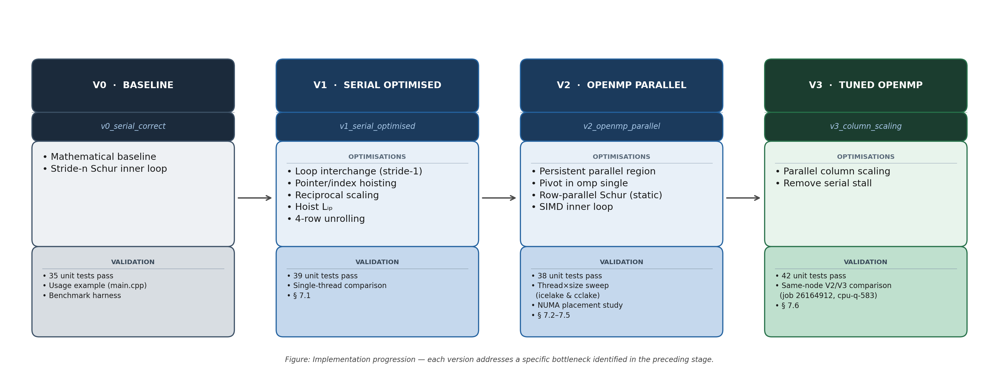

# MPhil DIS C2 High Performance Scientific Computing:
## Optimisation of OpenMP Cholesky Factorisation on CSD3

**Iuliia Vitiugova** \
MPhil in Data Intensive Science \
University of Cambridge \
Lent Term 2026

## Contents
1. Mathematical introduction
    - 1.1 Algorithmic structure (Cholesky-Banachiewicz)
    - 1.2 Calculation of floating point operations
    - 1.3 Logarithm of the determinant
2. Implementation
    - 2.1 Version 0: Serial baseline implementation
    - 2.2 Version 1: Serial optimized implementation
        - 2.2.1 OPT-1: Rearranging the order of loops
        - 2.2.2 OPT-2: Hoisting $p*n$ and row pointers
        - 2.2.3 OPT-3: Replacing division with multiplication
        - 2.2.4 OPT-4: Hoisting $L_{ip}$
        - 2.2.5 OPT-5: 4-wide i-unrolling
    - 2.3 Version 2: OpenMP Parallel Implementation
        - 2.3.1 Analysis of parallelisation and dependencies
        - 2.3.2 One parallel region
        - 2.3.3 OpenMP constructions
        - 2.3.4 Proof of the absence of data races
    - 2.4 Version 3: Parallelizing the column scaling
3. Roadmap of optimization versions
4. Test Methodology
6. Benchmark Methodology
7. Results and Discussion
    - 7.1 Single thread: $V0 \to V1 \to V2 \to V3$
    - 7.2 V2 OpenMP scaling (icelake)
    - 7.3 V2 OpenMP scaling (cclake)
    - 7.4 Partition comparison: icelake vs cclake
    - 7.5 Non-uniform memory access experiment (NUMA)
    - 7.6 Same node $V2$ vs $V3$ comparison
8. Conclusions \

Appendix 1: Repository structure \
Appendix 2: Tagged commits \
Appendix 3: Build and tests \
Appendix 4: Reproducibility pipeline \
References


## Abstract

This project investigates the optimisation of OpenMP Cholesky factorisation on CSD3. Starting from a serial baseline, we introduced a sequence of memory access and parallelisation improvements and evaluated their effect across problem sizes and thread counts. 

The optimised serial version significantly outperformed the baseline, and OpenMP parallelisation provided further gains for large matrices. The main conclusion is that performance is governed primarily by memory locality and synchronisation overhead, rather than by floating point operation count alone. Additionally, this project stresses the importance of cache behaviour, vectorisation, and parallelisation structures.


## 1. Mathematical introduction

A matrix $ C \in\mathbb{R}^{n\times n}$ is *symmetric positive definite* (SPD) if and only if there exists a unique lower triangular matrix $L$ with positive diagonal elements such that [1]:
$$C = LL^T. \tag{1}$$

The diagonal elements of L are given by recurrence relation:
$$L_{pp} = \sqrt{C_{pp} - \sum_{k=0}^{p-1} L_{pk}^2}, \qquad L_{pp} > 0 \ \text{(guaranteed by SPD property)} \tag{2}$$

The off-diagonal elements are given by:
$$L_{ip} = \frac{1}{L_{pp}}\left(C_{ip} - \sum_{k=0}^{p-1} L_{ik} L_{pk}\right), \quad i > p. \tag{3}$$

### 1.1 Algorithmic structure (Cholesky-Banachiewicz)

The factorisation can be expressed in a right looking (outer product) form that updates the trailing submatrix $C^{(p+1)}$ at each pivot step $p=0,1,\ldots,n-1$:

$$
\text{(i)}\ \ L_{pp} \leftarrow \sqrt{C_{pp}^{(p)}},\qquad
\text{(ii-a)}\ \ L_{pj} \leftarrow C_{pj}^{(p)} / L_{pp},\ j > p,\qquad
\text{(ii-b)}\ \ L_{ip} \leftarrow C_{ip}^{(p)} / L_{pp},\ i > p,
$$
$$
\text{(iii)}\ \ C_{ij}^{(p+1)} \leftarrow C_{ij}^{(p)} - L_{ip}\,L_{pj},\quad i,j > p. \tag{4}
$$


Here operation (iii) is the Schur complement update, which has the structure of a rank-1 update and is performed on the submatrix $(n-p-1) \times (n-p-1)$. [2][3]

### 1.2 Calculation of floating point operations
Summed number of operations with floating point numbers (FLOPs):

1. *Square roots*: $\sum_{p=0}^{n-1} 1 = n$ operations (negligible).
2. *Row + column scaling*: $\sum_{p=0}^{n-1} 2(n-p-1) = n(n-1) \approx n^2$ operations.
3. *Schur complement update*: the trailing block has $(n-p-1)^2$ elements at step $p$, so overall
$$\sum_{p=0}^{n-1}(n-p-1)^2 = \sum_{k=0}^{n-1}k^2 = \frac{(n-1)n(2n-1)}{6}\approx \frac{n^3}{3}.$$

In terms of *raw FLOPs*, each element update is a multiply and subtract, so the Schur step is about $2\sum (n-p-1)^2 \approx \frac{2}{3}n^3$ scalar FLOPs.

So the total operation count is:
$$W = \frac{n^3}{3} + O(n^2) \approx \frac{n^3}{3} \ \text{(for large } n\text{)}. \tag{5}$$

For $n = 4000$ this is $\approx 2.1 \times 10^{10}$.
For the final report, we used **GFLOP/s**.
### 1.3 Logarithm of the determinant
Since $\det(C) = \det(L)^2 = \left(\prod_{p=0}^{n-1} L_{pp}\right)^2$, we have
$$\log|\det(C)| = 2 \sum_{p=0}^{n-1} \log L_{pp}. \tag{6}$$

This formula allows us to compute $\log|\det(C)|$ with $O(n)$ operations from the already computed diagonal of $L$. It is mathematically invariant, in floating point arithmetic it is stable up to the expected $O(n\varepsilon)$ rounding error and should be independent of thread count.

## 2. Implementation

The library exposes one function: **mphil_dis_cholesky(double\* c, int n)** .
The matrix is a flatx row major array ($c[i\cdot n + j]$).

After a call, the same array stores the Cholesky factor:
the lower triangle contains $L$,and the upper triangle contains $L^T$ (the scaled pivot rows).
The return value is the elapsed time $t$ in seconds. For valid SPD input, $t \ge 0$;
error codes are negative $-1.0$ invalid input, $-2.0$ non-SPD pivot).

We report performance as
$$\text{GFLOP/s}=\frac{n^3}{3 \cdot t \cdot 10^9},$$
using the standard estimate $W(n)\approx \frac{n^3}{3}$. In the benchmark, if $t \le 0$ we print GFLOP/s as $0.0$.

### 2.1 Version 0: Serial baseline implementation
The goal of $V0$ is to implement the algorithm as close as possible to the mathematical definition (4).
It is the correctness reference point for all later optimisations.

Structure of loops in the Schur complement update (iii) in $V0$ is *j-outer / i-inner*:
```cpp
for (int j = p + 1; j < n; ++j) {
  for (int i = p + 1; i < n; ++i) {
    c[i * n + j] -= c[i * n + p] * c[p * n + j];
  }
}
```
In row major layout the inner loop strides by $n\times8$ bytes per iteration which is the main performance bottleneck (§7.1).

### 2.2 Version 1: Serial optimized implementation

Five optimizations have been applied. 

#### 2.2.1 OPT-1: Rearranging the order of loops

In row major storage, $V0$'s $j$-outer/$i$-inner loop strides by $n\times8$ bytes per inner step, so each iteration likely touches a new cache line (cache lines are typically 64 bytes, holding 8 doubles). Swapping to $i$-outer/$j$-inner ($V1$) makes the inner loop stride-1, so most of each loaded cache line is used:
```cpp
for (int i = p + 1; i < n; ++i) {          // i - outer loop
    Lip = c[i*n+p]            // scalar load (one)
    for (int j = p + 1; j < n; ++j) {      // j - inner loop, stride-1
        c[i*n+j] -= Lip * c[p*n+j]
    }
}
```
This is the main reason OPT-1 delivers the largest share of the V1 speedup (§7.1).

#### 2.2.2 OPT-2: Hoisting $p*n$ and row pointers

We reduce repeated index arithmetic by computing $p\cdot n$ once per pivot and using row pointers:
```cpp
const int pn = p * n;
double* row_p = c + pn;
...
double* row_i = c + i * n;
```
This avoids recomputing expressions like $p\cdot n + j$ and $i\cdot n + j$ inside inner loops, reducing integer arithmetic overhead and making the loop structure simpler for the compiler.

#### 2.2.3 OPT-3: Replacing division with multiplication 

*Theoretical analysis* \
*«division does
not vectorise, so there is a parallelisation penalty»* [4, §4]

Instead of dividing by *diag* many times, we compute one reciprocal:

```cpp
const double inv_diag = 1.0 / diag;   // one division per step p
for (int j = p + 1; j < n; ++j)
     row_p[j] *= inv_diag;  // multiplication, vectorised
for (int i = p + 1; i < n; ++i) 
    c[i * n + p] *= inv_diag;    // similarly
```
So at step $p$ we do 1 division instead of about $2(n-p-1)$ divisions, which also enables the scaling loops to vectorise.

#### 2.2.4 OPT-4: Hoisting $L_{ip}$

Inside the Schur update, $L_{ip}$ does not depend on $j$, so we load it once:

```cpp
for (int i = p + 1; i < n; ++i) {
    ...
    const double Lip = c[i * n + p];  // hoisted
    for (int j = p + 1; j < n; ++j) {
        row_i[j] -= Lip * row_p[j];
    }
}
```
This avoids re-reading the same $L_{ip}$ value for every $j$ iteration and makes the inner loop simpler for the compiler.

#### 2.2.5 OPT-5: 4-wide i-unrolling

In V1, the outer $i$ loop of the Schur complement is unrolled by 4 rows: 
- We update 4 rows $(i, i+1, i+2, i+3)$ together. 
- For each $j$ we load $row_p[j]$ once and reuse it for 4 updates. 

This improves reuse of $row_p[j]$ and exposes instruction-level parallelism: the four multiply/subtract updates are independent (often emitted as fused multiply-add (FMA) instructions by the compiler).

### 2.3 Version 2: OpenMP Parallel Implementation

#### 2.3.1 Analysis of parallelisation and dependencies

The outer loop over $p$ is sequential: pivot step $p$ uses $C^{(p)}_{pp}$ which depends on the trailing submatrix updates performed at previous steps (in particular $p-1$). Therefore, the $p$-loop cannot be parallelised.

For a fixed pivot $p$, the Schur complement update can be parallelised by rows $i=p+1,\dots,n-1$. After the pivot row/column have been computed, each iteration $i$ updates only entries in row $i$ (writes $c[i*n + j]$ for $j>p$) and reads the pivot row $p$. Since different $i$-rows write disjoint memory regions, the work over $i$ is independent and can be distributed across threads.

#### 2.3.2 One parallel region

Creating and destroying an OpenMP group of threads inside the $p$-loop would add repeated fork/join overhead. Instead, we create the group once and reuse it across all pivot steps:

```cpp
#pragma omp parallel default(none) shared(c, n, err) // V2 shared clause
{
    for (int p = 0; p < n; ++p) {    
        #pragma omp single     // sqrt, row/col scaling, inv_diag (local), O(n) serial
        {
            // pivot check + sqrt + inv_diag
            // scale row p (j>p)
            // scale column p (i>p)
        } // implicit barrier, all threads see row_p and col_p before Schur
        if (err) break;
        const double* row_p = c + p*n;
        #pragma omp for schedule(static)  // parallel Schur complement, O(n^2) parallel
        for (int i = p+1; i < n; ++i) {
            double* row_i = c + i*n;
            const double Lip = row_i[p];
            // row_i[p] is already scaled in the omp single block (V2).
            #pragma omp simd
            for (int j = p+1; j < n; ++j)
                row_i[j] -= Lip * row_p[j];
        } // implicit barrier
    }
        // step p complete before next pivot
}
```

#### 2.3.3 OpenMP constructions

The following directives are from the OpenMP specification [5].

- **#pragma omp parallel default(none) shared(c, n, err)**: forks the OpenMP group of threads once and keeps it alive for all n pivot steps (persistent region, §2.3.2). The default(none) clause forces every variable used inside to be explicitly classified as shared or private, which helps avoid accidental data sharing errors. **shared(c, n, err)** lists the three variables all threads need: the matrix array c, the dimension $n$ (read only), and the error flag err (written in omp single, read by all). Other variables ($p$, $row_p$, $diag$, $inv-diag$, $row_i$, $Lip$, loop indices) are declared inside the region, so each thread gets its own private copies.
- **#pragma omp single, not omp master**: exactly one thread executes the enclosed block (pivot check, sqrt, row/column scaling), all other threads wait at the implicit barrier at the end of the block. omp master executes only on thread 0 but has no implicit barrier, so other threads could enter the Schur update before $row_p$ is fully written. The barrier after omp single guarantees that all threads see the updated pivot row/column before the Schur update starts.
- **#pragma omp for schedule(static)**: distributes the $i$-rows of the Schur complement across the group of threads. Work per row is uniform: each row $i$ performs exactly $n-p-1$ inner-j updates, so static scheduling assigns equal sized contiguous chunks with minimal runtime overhead. The implicit barrier at the end of omp for ensures the full Schur update for step $p$ is finished before the next pivot step reads $C^{(p+1)}_{p+1,p+1}$.
- **#pragma omp simd (with \_\_restrict\_)**: asks the compiler to vectorise the innermost $j$-loop $row_i[j] -= Lip * row_p[j]$. This is safe because each iteration updates a different element $row_i[j]$, so the iterations do not depend on each other, and $row_i$ and $row_p$ point to different rows of the same flat array, so their memory regions do not overlap. The compiler cannot always infer this reliably from pointer arithmetic alone, so __restrict__ is used to state this property explicitly.

#### 2.3.4 Proof of the absence of data races

1. Each thread updates a disjoint set of rows $i$ in the Schur complement (omp for splits the $i$-range). So no two threads write the same $c[i*n+j]$.
2. The pivot row $row_p$ is written only in omp single and is read-only afterwards. The implicit barrier after single guarantees visibility.
3. $err$ is written only inside omp single and read after the barrier (so all threads break consistently).
4. Variables like $Lip, row_i, row_p$, loop indices are private (declared inside the parallel region / loops).

So the V2 implementation has no race.

### 2.4 Version 3: Parallelizing the column scaling (tuning)

In V2, column scaling $c[i*n+p] \mathrel{*}= \text{inv\_diag}$ for $i > p$ runs inside *omp single*, creating a serial stall while other threads wait. In V3, $\text{inv\_diag}$ is stored in a shared variable and column scaling moves into the *omp for* loop: each thread scales its own $row_i[p]$ and uses it immediately as $L_{ip}$. Pivot row scaling remains in *omp single* because $row_p[j]$ must be fully written before any thread enters the Schur loop.

## 3. Roadmap of optimization versions



## 4. Test Methodology

Two test executables are built alongside the library:

- **cholesky_test_n2**: a standalone test (test/test_n2.cpp). It runs the example $\mathbf{C} = \bigl[\begin{smallmatrix}4&2\\2&26\end{smallmatrix}\bigr]$ and checks every element of the stored result against the expected value $\bigl[\begin{smallmatrix}2&1\\1&5\end{smallmatrix}\bigr]$ within tolerance $10^{-12}$. The stored result is symmetric, the implementation writes $L$ into the lower triangle and $L^\top$ into the upper, so after the call $c = [2, 1, 1, 5]$ (not the purely lower-triangular $\bigl[\begin{smallmatrix}2&0\\1&5\end{smallmatrix}\bigr]$).

- **cholesky_test**: the full suite (test/test_cholesky.cpp). It runs under **ctest** with **OMP_NUM_THREADS=1** as the default; groups that need multiple thread counts call **omp_set_num_threads()** internally to override this. \
Test counts by version: \
V0 - 35 tests,
V1 - 39 tests,
V2 - 38 tests,
V3 - 42 tests. \
All checks use $t >= 0.0$ (not $t > 0.0$) because on tiny-$n$ inputs **omp_get_wtime()** returns exactly $0.0$; error codes $-1.0$ and $-2.0$ are unambiguously negative.

The test hook **mphil_dis_cholesky_step()** and the TID recorder and write-stride probe it relies on live in a separate translation unit (**src/mphil_dis_cholesky_testing.cpp**). This file is compiled only into the static library **cholesky_testing_hooks**, which is linked exclusively to **cholesky_test** and **cholesky_test_n2**. The production library **cholesky_lib** (and therefore **cholesky_example** and **cholesky_benchmark**) contains no test code.

All tests are grouped into 11 groups (A-K):

**Groups A–F** form the baseline tests, they cover: simple matrix example, three matrix closed form with known $\mathbf{L}$, five error sizes, the log-det identity, all error return codes, and the symmetry invariant. 

**Group G** provides per step correctness via `test_step_level`. Instead of checking only the final output, it compares `mphil_dis_cholesky_step()` against `ref_step()` after every pivot, catching bugs that accumulate over steps or cancel in the full factorisation.

**Groups H and H2** prove the OpenMP implementation. `test_openmp_thread_invariance` rules out data races by requiring logdet to be thread count invariant; `test_v3_col_scaling_parallel` then proves structurally by inspecting which threads wrote which column entries that V3's column scaling actually runs in parallel, a property that H cannot verify because both V2 and V3 produce numerically correct results.

**Groups I, I2, J** close targeted gaps for specific optimisations. `test_v1_tail_coverage` and `test_v1_opt1_structural` checks V1's scalar tail and loop order claim. `test_barrier_sanity` checks V2/V3 barrier semantics using a scaled matrix that makes missing barrier corruption catastrophically large.

**Group K** rules out a corr() specific implementation by testing a second deterministic SPD family.

More detaild exlanation of each test group is in the *Appendix 3: Build and tests*. 


## 6. Benchmark Methodology 
We benchmarked **mphil_dis_cholesky()** using the same deterministic SPD input $corr(n)$ as in tests. For each $(n, threads)$ setting we run one warm up call (not recorded), then 3 timed repeats. Before each timed repeat we restore the input matrix by copying a precomputed $C_{orig}$ into a work buffer, since the factorisation overwrites the array. We report the upper median of the 3 timings (run = $-1$ in the CSV) to reduce sensitivity to occasional OS jitter.

Thread count is controlled by **--cpus-per-task=T** in SLURM with **OMP_NUM_THREADS=T**; pinning settings are listed in the reproducibility table (§7).

(*Experiment ledger* with job IDs/CSV filenames is in Appendix 3)

## 7. Results and Discussion

*Reproducibility metadata* \
The settings below were used for all results in this section, unless we explicitly state otherwise.

| Item | Value |
|------|-------|
| Code tags | `v0_serial_correct`, `v1_serial_optimised`, `v2_openmp_parallel`, `v3_column_scaling` |
| CMake flag | `-DCHOLESKY_VERSION=0/1/2/3 -DCMAKE_BUILD_TYPE=Release` |
| Platform | CSD3 icelake (76 cores) and cclake (56 cores) partitions [9] |
| Compiler | GCC 11; `-O3 -march=icelake-server` (icelake) / `-march=cascadelake` (cclake) |
| OpenMP | `-fopenmp` for V2/V3; not linked for V0/V1 |
| Thread control | `OMP_NUM_THREADS=<T>` + `--cpus-per-task=<T>` in SLURM script |
| Pinning | `OMP_PROC_BIND=close OMP_PLACES=cores` |
| Input | `corr(n)` (spd matrix), reset each run; 1 warm-up + 3 timed, median (upper-median for even repeats) |

GFLOP/s is defined throughout as $W/t$ where $W = n^3/3$ FLOPs (the standard estimate for right looking Cholesky) and $t$ is the wall-clock time returned by **mphil_dis_cholesky**.

#### 7.1 Single thread: $V0 \to V1 \to V2 \to V3$

*Partition*: icelake (nodes cpu-q-225/cpu-q-210/cpu-q-536/cpu-q-579). \
All versions at $T=1$ (1 thread). \
GCC 11 -O3 -march=icelake-server; -fopenmp linked for V2/V3 only.

| $n$ | V0 | V1 | V1/V0 | V2 ($T=1$) | V3 ($T=1$) | V1/V2 |
|---------|------|------|-------|--------------|--------------|-------|
| 500     | 1.00 | 3.79 | 3.8x | 3.77 | 3.87 | 1.01 |
| 1000    | 0.727 | 2.45 | 3.4x | 3.03 | 3.07 | 0.81 |
| 2000    | 0.517 | 0.849 | 1.6x | 3.09 | 3.14 | 0.27 |
| 4000    | 0.321 | 0.729 | 2.3x | 1.84 | 2.03 | 0.40 |
| 8000    | 0.154 | 0.737 | 4.8x | 1.54 | 1.59 | 0.48 |

*Sources: V0 jobs 26153761 (n≤4000, cpu-q-225) and 26458876 (n=8000, cpu-q-142, 1 repeat); V1 job 26090357; V2 job 26033045; V3 job 26093278. All values are the median timed run (run=-1 in CSV).*

**$V0 \to V1$** \
V1 applies OPT-1 (loop swap) as the primary change, plus OPT-2–OPT-5 (hoisting, reciprocal, unrolling). The measured speedup is $3.4–3.8\times$ at $n=500$–$1000$, dropping to $1.6\times$ at $n=2000$ and recovering to $4.8\times$ at $n=8000$ as V0's stride-$n$ waste grows with matrix size.

**$V1 \to V2$** \
At $T=1$, $V1$ is $2.1–3.6\times$ slower than V2 for $n \ge 2000$, so the gap is not a parallelism effect. The key code changes in V2 are `#pragma omp simd` on the inner $j$-loop and `__restrict__` on the pivot and update row pointers, enabling stronger compiler vectorisation.

**$V2 \to V3$** \
Any small deviations at $T=1$ are measurement noise (difference is $0$–$2\%$): V3's only change — moving column scaling from omp single into omp for — has no effect with one thread.


*Figure:* Single-thread GFLOP/s vs $n$, V0–V3 on icelake. V2/V3 exceed V1 at large $n$ due to stronger SIMD vectorisation.


*Figure:* Wall-clock time vs $n$ (log–log) for all versions on icelake. All versions follow $O(n^3)$ scaling; the gap between serial and parallel versions grows rapidly with $n$.

**Cache locality** \
 In V0 the Schur update strides by $n\times8$ bytes per inner step ($\approx125$ cache lines per iteration at $n=1000$). OPT-1 swaps to stride-1, giving $3.4$–$3.8\times$ at small $n$; the drop to $1.6\times$ at $n=2000$ reflects the $32$ MB matrix increasingly depending on data movement through the memory hierarchy rather than cache reuse. At $T=1$ for $n\ge2000$, V2 is $2.1$–$3.6\times$ faster than V1 due to `#pragma omp simd` + `__restrict__` enabling AVX-512 vectorisation, consistent with GCC generating wider SIMD than $V1$'s manually unrolled block allows (inferred from timing).

### 7.2 V2 OpenMP scaling (icelake)

*Partition*: icelake (node cpu-q-536, job 26033045). CHOLESKY_VERSION=2. \
GCC 11 -O3 -march=icelake-server -fopenmp, Release. OMP_NUM_THREADS=T; OMP_PROC_BIND=close, OMP_PLACES=cores.

| $T$ | $n=500$ | $n=1000$ | $n=2000$ | $n=4000$ | $n=8000$ |
|-----|---------|----------|----------|----------|----------|
| 1  | 3.77 | 3.03 | 3.09 | 1.84 | 1.54 |
| 16 | **11.39** | **24.19** | 31.10 | 27.70 | 10.40 |
| 32 | 8.90 | 22.35 | 46.30 | 46.44 | 11.61 |
| 48 | 6.77 | 18.48 | **50.67** | 59.27 | 12.24 |
| 64 | 4.49 | 17.97 | 44.42 | **68.45** | 12.64 |
| 76 | 3.22 | 13.94 | 35.74 | 63.50 | **13.09** |

Bold = peak GFLOP/s for that $n$. Peak overall: **68.45 GFLOP/s** at $n=4000$, $T=64$ (speedup $37.2\times$, efficiency $58\%$). Optimal $T$ varies strongly with $n$ — three regimes: (1) **Small $n$ ($\leq1000$)**: $2n$ barriers per run dominate ($s\approx7$–$29\%$), scaling saturates at $T\leq16$ with $S_\infty\approx3.5\times$. (2) **Mid $n$ (2000–4000)**: the $O(n^3)$ Schur work reduces $s$, but cross-socket reads of $row_p$ cap scaling — optimal at $T^\star=48$ for $n=2000$ and $T^\star=64$ for $n=4000$. (3) **Large $n$ ($8000$)**: memory bandwidth is the bottleneck; only $+13\%$ gain from $T=32$ to $T=76$.


*Figure:* V2 GFLOP/s vs thread count $T$ on icelake. $n=4000$ scales best (peak $68.45$ GFLOP/s at $T=64$); $n=2000$ drops after $T=48$; $n=8000$ flattens beyond $T\approx32$.


*Figure:* Parallel speedup $S(T)$ vs $T$ for V2 on icelake. Best scaling at $n=4000$ ($S(64)=37.2\times$); dashed line is ideal.


*Figure*: $S(T)$ heatmap over all $(n,T)$ combinations, V2 icelake. Bottom-right (small $n$, high $T$) shows $S<1$; top right reaches $\approx37\times$.


*Figure*: Parallel efficiency $E(T)$ vs $T$, V2 icelake. At $n=500$ efficiency drops sharply with $T$; at $n=4000$ it remains $\approx58\%$ at $T=64$.

**Amdahl analysis** \
 We use Amdahl's law  $S_{\text{Amdahl}}(T)=1/(s+(1-s)/T)$ to quantify the effective serial fraction $s$. [6] Per point estimates from the peak speedup ($s = (T/S(T)-1)/(T-1)$):

| Version | $n$ | $T$ | $S(T)$ | $s$ |
|---------|-----|-----|--------|-----|
| V2 | 500  | 16 | 3.02× | **28.7%** |
| V2 | 1000 | 16 | 7.98× | 6.7% |
| V2 | 4000 | 64 | 37.1× | 1.2% |
| V3 | 500  | 8  | 3.46× | **18.8%** |
| V3 | 1000 | 16 | 9.28× | 4.8% |
| V3 | 4000 | 64 | 44.4× | 0.7% |

At small $n$, $s$ is large because $2n$ barriers and serial omp single work (including column scaling in V2) are a significant fraction of total time; $S_\infty=1/s\approx3.5\times$ matches observed saturation. At $n=4000$, $s$ drops to $1.2\%$ as $O(n^3)$ Schur work dominates, enabling $37\times$ speedup. V3 reduces $s$ at every size by removing column scaling from the serial region ($s$ drops from $1.2\%$ to $0.7\%$ at $n=4000$). Note that $s$ bundles explicit serial code, barrier waiting, and bandwidth effects — much larger than the naive $O(n)/O(n^3)\sim O(1/n)$ FLOP argument would suggest.


*Figure*: Measured $S(T)$ vs $T$ for V2 on icelake with fitted Amdahl curves overlaid. Larger $n$ → smaller $s$ → better scaling.


*Figure:* Same for V2 on cclake. Qualitative trend matches icelake; fitted $s$ values generally larger, reflecting higher relative overheads and lower bandwidth ceiling.

### 7.3 V2 OpenMP scaling (cclake)

Cclake (node cpu-p-163), GCC 11 -O3 -march=cascadelake, $T \in \{1,2,4,8,16,32,48,56\}$:

| $T$ | $n=500$ | $n=1000$ | $n=2000$ | $n=4000$ | $n=8000$ |
|-----|---------|----------|----------|----------|----------|
| 1   | 3.41 | 2.93 | 2.91 | 1.59 | 1.45 |
| 8   | 5.71 | 10.92 | 15.31 | 11.72 | 6.04 |
| 16  | **6.05** | **15.38** | 25.22 | 17.91 | **6.55** |
| 32  | 4.91 | 14.87 | **31.03** | 24.75 | 6.50 |
| 48  | 2.44 | 8.42  | 21.12 | 33.59 | 6.46 |
| 56  | 3.00 | 8.07  | 19.40 | **36.68** | 6.56 |

Peak: **36.68 GFLOP/s** at $n=4000$, $T=56$ ($23.1\times$). Qualitative trends match icelake: synchronisation limits small $n$, $n=2000$ drops above $T=32$ from cross socket reads of $row_p$ (§7.5); $n=8000$ is bandwidth limited (§7.4). Absolute peaks are lower than icelake, consistent with lower per socket theoretical peak bandwidth ($\approx141$ vs $\approx204$ GB/s [9]) and fewer cores ($56$ vs $76$).


*Figure*: V2 GFLOP/s vs $T$ on cclake. Peak $36.68$ GFLOP/s at $n=4000$, $T=56$; $n=2000$ drops above $T=32$; $n=8000$ is essentially flat from $T=16$.


*Figure*: $S(T)$ heatmap, V2 cclake. Peak $23.1\times$ at $n=4000$, $T=56$; $n=500$ shows $S<1$ at high $T$.

### 7.4 Partition comparison and bandwidth saturation

At $n=4000$: icelake peaks at $68.45$ GFLOP/s ($T=64$) vs cclake $36.68$ GFLOP/s ($T=56$) — a $1.87\times$ gap. At $n=8000$: $13.09$ vs $6.56$ GFLOP/s ($2.0\times$). These ratios are consistent with the per socket theoretical peak bandwidth ($\approx204$ vs $\approx141$ GB/s [9]) and the higher core count on icelake ($76$ vs $56$).

**Memory bandwidth saturation.** Using the roofline model [8], the Schur update arithmetic intensity is $AI \approx 2/24 = 0.083$ FLOP/B (1 FMA per element, $8$ B read $row_p[j]$ + $8$ B read + $8$ B write $row_i[j]$), well below typical balance points. The per socket theoretical peak gives a roofline ceiling of $0.083 \times 204 \approx 17$ GFLOP/s (icelake) and $0.083 \times 141 \approx 12$ GFLOP/s (cclake). Observed $13.09$ and $6.56$ GFLOP/s at $n=8000$ are below these ceilings, confirming bandwidth limited behaviour; the kernel cannot saturate the full dual socket aggregate because the pivot row broadcast crosses the UPI inter-socket link (§7.5). The $2\times$ inter-platform gap is consistent with the bandwidth ratio. [7]


*Figure*: V2 GFLOP/s vs $T$ for icelake (blue) and cclake (red) at $n=2000$ and $n=4000$. icelake sustains higher throughput, consistent with its higher bandwidth and core count.


*Figure*: Peak GFLOP/s over all thread counts on icelake, all versions. V3 uses same-node data for $n\in\{2000,4000\}$ to reduce node-to-node variation in the $V2/V3$ comparison.


*Figure*: Peak GFLOP/s on cclake ($V2$). Lower than icelake at large $n$ due to lower bandwidth.

## 7.5 Non-Uniform memory access experiment (NUMA)

Cclake node cpu-p-134, V2, $n=2000$; only `OMP_PROC_BIND` varied between runs, all other settings identical:

| $T$ | close (GFLOP/s) | spread (GFLOP/s) | close/spread |
|-----|-----------------|-----------------|-------------|
| 4   | 8.37  | 10.52 | 0.80 — spread wins |
| 8   | 15.25 | 15.37 | ≈ 1.0 |
| 16  | 24.78 | 21.35 | 1.16 |
| 32  | **30.89** | 23.85 | 1.29 |
| 56  | 22.87 | 12.54 | **1.82** — close wins by 82% |

`close` outperforms `spread` from $T\geq16$, reaching $1.82\times$ at $T=56$. The Schur inner loop reads the same pivot row $row_p$ ($\approx16$ KB at $n=2000$) for every updated row $i$ — a broadcast/read pattern characteristic of NUMA-sensitive kernels. With `close`, threads stay on one socket longer, keeping $row_p$ hot in local cache; with `spread`, a larger fraction fetch $row_p$ via the inter-socket link, adding remote access latency. The exception at $T=4$ (spread wins by $1.25\times$) occurs because at low thread counts remote-read pressure is small and spreading improves aggregate write bandwidth. **Use `OMP_PROC_BIND=close OMP_PLACES=cores` for this kernel on dual-socket nodes.**


*Figure*: Ratio GFLOP/s(close)/GFLOP/s(spread) vs $T$ at $n=2000$, cclake. Ratio crosses $1.0$ between $T=8$ and $T=16$, reaches $1.82$ at $T=56$.


*Figure*: Absolute GFLOP/s for close and spread vs $T$ at $n=2000$, cclake. `close` peaks at $T=32$ ($30.89$ GFLOP/s); `spread` drops sharply to $12.54$ GFLOP/s at $T=56$.

### 7.6 Same node V2 vs V3 comparison

Both versions built and benchmarked in one SLURM allocation on the same node to eliminate node-to-node variation. $n \in \{2000, 4000\}$; $T \in \{1, 32, 48, 64, 76\}$; 5 repeats, median.

| $T$ | $V2$ $n=2000$ | $V3$ $n=2000$ | $\Delta$% | $V2$ $n=4000$ | $V3$ $n=4000$ | $\Delta$% |
|-----|-------------|-------------|-----------|-------------|-------------|-----------|
| 1   | 3.11  | 3.15  | +1  | 2.04  | 2.04  |  0  |
| 32  | 46.45 | 65.38 | **+41** | 45.91 | 51.82 | +13 |
| 48  | 48.57 | 50.20 | +3  | 59.81 | 70.62 | +18 |
| 64  | 42.84 | 51.92 | +21 | 72.03 | **90.48** | **+26** |
| 76  | 46.47 | 55.08 | +19 | 71.79 | 89.97 | +25 |

Key observations: $V3$ is $+41\%$ at ($n=2000$, $T=32$) and $+26\%$ at ($n=4000$, $T=64$); at $T=1$ the difference is $\le 1\%$. The gain is disproportionate to the $O(n^2)/O(n^3)$ FLOP share of column scaling because the bottleneck is memory latency: in V2 one thread walks the column with stride $n\times8$ bytes while the other $T-1$ threads idle at the barrier. V3 distributes this work across threads in omp for, each thread scaling its own row and using the result immediately as $L_{ip}$. The gain is proportionally larger at $n=2000$ than $n=4000$ because the serial fraction scales as $O(n^2)$ while the Schur work scales as $O(n^3)$.


*Figure*: GFLOP/s for $V2$ (dashed) and $V3$ (solid) vs $T$ at $n\in\{2000,4000\}$, same node. V3 gap widens with $T$ and is proportionally larger at $n=2000$.


*Figure*: V3/V2 improvement heatmap over $(n,T)$. Gain peaks at $+41\%$ for $(n=2000,T=32)$; near zero at $T=1$ and $n=8000$.

---

## 8. Conclusions

The peak GFLOP/s bar charts (§7.4) summarise the optimisation path from $V0 \to V3$ on icelake. Improvements are stepwise: $V0 \to V1$ gives up to $3.8\times$ at small $n$ by restoring stride-1 cache access, dropping to $1.6\times$ at $n=2000$ as the $32\,\text{MB}$ matrix becomes memory bounded; $V1 \to V2$ adds $2.1$–$3.6\times$ at $T=1$ from stronger SIMD vectorisation, then further gains from parallelism; $V2 \to V3$ adds up to $41\%$ at mid $n$ by removing a serial stall. The final implementation (V3) reaches **90.48 GFLOP/s** at $n=4000, T=64$ on icelake. At $n=8000$ all versions are bandwidth limited.

The main lesson is that performance is determined by *memory access patterns* and *synchronisation* rather than by FLOPs count.

1. **$V0$ (baseline)**. Correctness reference. Main bottleneck: stride-$n$ access in the Schur update.

2. **$V1$ (serial optimisations)**. OPT-1 (loop order swap) restores stride-1 access and gives the dominant gain; OPT-2–5 add smaller improvements via hoisting, reciprocal scaling, and unrolling.

3. **$V2$ (OpenMP parallel)**. Reaches $68.45\,\text{GFLOP/s}$ at $n=4000, T=64$ ($37\times$, $58\%$ efficiency). Optimal $T$ is strongly $n$-dependent: barriers dominate at small $n$, bandwidth dominates at large $n$ — use measured curves rather than a fixed $T$.

4. **$V3$ (tuning)**. Parallelising column scaling removes a serial memory-latency stall, adding up to $+41\%$ at mid $n$ ($+26\%$ at $n=4000, T=64$). Peak: $90.48\,\text{GFLOP/s}$ at $n=4000, T=64$.

**NUMA**: `OMP_PROC_BIND=close` outperforms `spread` by up to $1.82\times$ at $T=56$ (§7.5) due to the broadcast/read pattern of the pivot row.

## Appendix 1: Repository structure

```
c2_cholesky/
├── include/
│   └── mphil_dis_cholesky.h          # Public API header
├── src/
│   ├── mphil_dis_cholesky.cpp        # All four implementations (V0–V3), selected by CHOLESKY_VERSION
│   └── mphil_dis_cholesky_testing.cpp# Test-only hooks: step oracle, TID recorder, write-stride probe
│                                     # Compiled into cholesky_testing_hooks only; never into production
├── test/
│   ├── test_n2.cpp                   # Standalone smoke test (cholesky_test_n2 binary)
│   └── test_cholesky.cpp             # Full test suite, Groups A–K (cholesky_test binary)
├── benchmark/
│   └── benchmark.cpp                 # CSV benchmark harness (cholesky_benchmark binary)
├── example/
│   └── main.cpp                      # Usage demo: corr(n) input -> factorisation -> logdet + GFLOP/s
├── jobs/                             # CSD3 SLURM scripts
│   ├── bench_icelake_v0.sh           # V0 serial, icelake, n=500–4000
│   ├── bench_icelake_v0_n8000.sh     # V0 serial, icelake, n=8000
│   ├── bench_icelake_v1.sh           # V1 serial optimised, icelake
│   ├── bench_icelake.sh              # V2 full thread sweep, icelake
│   ├── bench_icelake_v3.sh           # V3 full thread sweep, icelake
│   ├── bench_cclake.sh               # V2 full thread sweep, cclake
│   ├── bench_cclake_numa.sh          # NUMA close vs spread, cclake, n=2000
│   ├── compare_v2v3_icelake.sh       # Same-node V2/V3 back-to-back, icelake
│   └── example_icelake.sh            # Run example/main.cpp on icelake
├── scripts/
│   └── plot_bench.py                 # Reads results/*.csv -> produces report/figures/*.png + report/tables/
├── results/                          # Raw benchmark CSVs (one per SLURM job)
│   ├── bench_icelake_v0_26153761_20260325_212344.csv
│   ├── bench_icelake_v0_n8000_26458876_20260328_144504.csv
│   ├── bench_icelake_v1_26090357_20260325_124737.csv
│   ├── bench_icelake_26033045_20260324_125600.csv
│   ├── bench_icelake_v3_26093278_20260325_134511.csv
│   ├── bench_cclake_26033046_20260324_160653.csv
│   ├── bench_cclake_numa_close_26093275_20260325_155822.csv
│   ├── bench_cclake_numa_spread_26093275_20260325_155822.csv
│   ├── compare_v2_26164912_cpu-q-583.csv
│   └── compare_v3_26164912_cpu-q-583.csv
├── report/
│   ├── report_my.md                  # This report
│   ├── figures/                      # Generated plots (19 PNG files)
│   └── tables/                       # Generated peak summary (peak_summary.csv / .md)
├── notebooks/
│   └── usage_demo.ipynb              # Jupyter demo
├── CMakeLists.txt                    # CMake file; -DCHOLESKY_VERSION=N selects implementation
├── README.md                         # Build and usage guide
└── DEVELOPMENT.md                    # Development notes and thought process
```

**CMake targets built from this tree:**

| Target | Type | Links | Purpose |
|--------|------|---------------|---------|
| `cholesky_lib` | static lib | - | Production library (V0–V3 via `CHOLESKY_VERSION`) |
| `cholesky_testing_hooks` | static lib | `cholesky_lib` | Test-only hooks (`mphil_dis_cholesky_testing.cpp`) |
| `cholesky_example` | executable | `cholesky_lib` | Usage demo |
| `cholesky_test_n2` | executable | `cholesky_testing_hooks` | Smoke test |
| `cholesky_test` | executable | `cholesky_testing_hooks` | Full test suite (Groups A–K) |
| `cholesky_benchmark` | executable | `cholesky_lib` | CSV benchmark harness |

---

## Appendix 2: Tagged commits

| Tag | Description |
|-----|-------------|
| `v0_tests` | Initial 27 test suite |
| `v0_1_tests` | Extended test suite (n=2 example) |
| `v0_serial_correct` | Version 0 baseline implementation |
| `v0_example` | Example program with corr() matrix |
| `v1_serial_optimised` | Version 1: five serial optimisations |
| `v2_openmp_parallel` | Version 2: OpenMP persistent region + SIMD |
| `v3_column_scaling` | Version 3: column scaling parallelised |

---

## Appendix 3: Build and tests

**Local build:**
```bash
# Configure (replace N with 0, 1, 2, or 3)
cmake -S . -B build -DCHOLESKY_VERSION=N -DCMAKE_BUILD_TYPE=Release

# Build all targets
cmake --build build -j4

# Run tests (OMP_NUM_THREADS=1 enforced by ctest)
ctest --test-dir build --output-on-failure
```

**macOS note:** OpenMP requires `libomp` from Homebrew (`brew install libomp`). CMakeLists.txt detects Apple Clang and sets the necessary flags automatically.

**Build all four versions in separate directories (no conflicts):**
```bash
for V in 0 1 2 3; do
    cmake -S . -B build_v$V -DCHOLESKY_VERSION=$V -DCMAKE_BUILD_TYPE=Release
    cmake --build build_v$V -j4
    ctest --test-dir build_v$V --output-on-failure
done
```

**CSD3: submit benchmark jobs (from repo root, after `mkdir -p logs results`):**
```bash
mkdir -p logs results

sbatch jobs/bench_icelake_v0.sh         # V0 icelake, n=500–4000
sbatch jobs/bench_icelake_v0_n8000.sh   # V0 icelake, n=8000 
sbatch jobs/bench_icelake_v1.sh         # V1 icelake, n=500–8000
sbatch jobs/bench_icelake.sh            # V2 icelake, full nxT sweep
sbatch jobs/bench_icelake_v3.sh         # V3 icelake, full nxT sweep
sbatch jobs/bench_cclake.sh             # V2 cclake, full nxT sweep
sbatch jobs/bench_cclake_numa.sh        # V2 cclake, NUMA close vs spread, n=2000
sbatch jobs/compare_v2v3_icelake.sh     # V2 and V3 back to back, same node, n=2000/4000
```

**Generate all figures and tables from results CSVs:**
```bash
python3 scripts/plot_bench.py --results results/ --outdir report/
# Outputs: report/figures/*.png (19 figures), report/tables/peak_summary.{csv,md}
```

**Check a specific CSV result directly:**
```bash
# Print median rows (run=-1) from CSV
grep -v '^#' results/<file>.csv | awk -F',' '$4==-1 {print $2,$3,$6}'
```

#### Test groups

| Group | Function(s) | Versions | Checks (V3) | Property verified |
|-------|-------------|----------|-------------|-------------------|
| A -  Example | `test_spec_2x2` | all | 2 | $2 \times 2$ example: stored array after the call equals `[2, 1, 1, 5]` within $10^{-14}$. This is the ground-truth case given in the spec; any implementation error shows up immediately. Return value $t \geq 0.0$ checked separately. |
| B - Analytical | `test_scalar_n1`, `test_identity`, `test_scaled_identity` | all | 8 | Closed-form checks: $n=1$ scalar ($\sqrt{4}=2$); identity $\mathbf{I}_n$ (diagonal $\equiv1$, logdet $\equiv0$); $k\mathbf{I}_n$ (diagonal $=\sqrt{k}$, logdet $=n\log k$). Catches sign errors and off-diagonal contamination. |
| C - Backward error | `test_corr_backward` | all | 5 | $\|\mathbf{C} - \hat{\mathbf{L}}\hat{\mathbf{L}}^\top\|_F / \|\mathbf{C}\|_F \leq (10\text{–}20)\,n\varepsilon$ for corr() SPD at $n \in \{5,16,64,128,200\}$. Uses lower triangle only; symmetry bugs covered separately by Group F. |
| D - Log-det identity | `test_logdet_2x2_analytical`, `test_logdet_corr_sign` | all | 2 | Verifies $\log\lvert\det\mathbf{C}\rvert = 2\sum_p \log L_{pp}$ (Eq. 6): exact check at $n=2$ and against inline reference at $n=64$. |
| E - Invalid inputs | `test_invalid_inputs`, `test_non_spd` | all | 6 | Null pointer, $n \leq 0$, $n > 10^5$ each return $-1.0$. Non-SPD matrix returns $-2.0$. |
| F - Structural | `test_structure` | all | 4 | After the call: $c[i \cdot n + j] = c[j \cdot n + i]$ within $10^{-13}$ for all $i \neq j$ (lower–upper symmetry); $L_{pp} > 0$ for all $p$. These are separate from backward error: a wrong mirroring direction would pass Group C but fail here. |
| G - Step oracle | `test_step_level` | all | 2 | Per-pivot comparison of `mphil_dis_cholesky_step()` against `ref_step()` at $n\in\{5,16\}$; tol $50\,n\varepsilon\,\|\mathbf{C}\|_\infty$. Catches one-step bugs that cancel in the full result. |
| H - Thread invariance | `test_openmp_thread_invariance` | V2, V3 | 2 | Logdet deviation $\leq10^{-10}$ across $T\in\{1,2,4,8,16\}$. Confirms no data races and no thread-count-dependent rounding. |
| H2 - V3 col-scaling parallel | `test_v3_col_scaling_parallel` | V3  | 4 | At $n=256$, $T=8$: asserts $\geq2$ distinct thread IDs wrote column $p=0$, proving column scaling is parallel in V3 (V2 uses omp single for the same work). |
| I - V1 tail coverage | `test_v1_tail_coverage` | V1  | 2 | `mphil_dis_cholesky_step()` at $n\in\{6,7\}$, $p=0$: checks scalar-tail rows against `ref_step()`. A wrong loop bound in OPT-5 silently skips these rows. |
| I2 - V1 OPT-1 structural | `test_v1_opt1_structural` | V1  | 2 | Asserts write-address delta $=1$ (j-inner); the only non-timing proof that OPT-1's loop order is active. |
| J - Barrier sanity | `test_barrier_sanity` | V2, V3 | 1 | $100\times$-scaled matrix at $T=8$, $n=200$: a missing barrier after `omp single` produces errors $\approx4.5$ per element (twelve orders above tolerance), making the bug unmistakable. |
| K - SPD stress | `test_spd_stress` | all | 6 | Backward error (tol $20\,n\varepsilon$) and logdet (tol $n \cdot 10^{-12}$ vs inline reference) for $\mathbf{C} = \mathbf{A}\mathbf{A}^\top + 0.1\mathbf{I}$ ($A_{ij} = \sin((i+1)(j+1))/\sqrt{n}$) at $n \in \{8, 40\}$. Confirms correctness is not restricted to the corr() group. |

---

## Appendix 4: Reproducibility pipeline

The end-to-end pipeline from source code to report figures is fully scripted; no manual data manipulation occurs at any stage.

```
Source code                 CSD3 SLURM jobs                  Raw output
──────────────────────    ──────────────────────────────    ──────────────────────────
include/                  bench_icelake_v0.sh          ─┐
src/                      bench_icelake_v0_n8000.sh    ─┤
test/                     bench_icelake_v1.sh          ─┤
benchmark/          ───►  bench_icelake.sh             ─┼──► results/*.csv
example/                  bench_icelake_v3.sh          ─┤    (one file per job;
CMakeLists.txt            bench_cclake.sh              ─┤     embeds: hostname,
                          bench_cclake_numa.sh         ─┤     job ID, version,
                          compare_v2v3_icelake.sh      ─┘     compiler flags,
                                                               timestamp)
                                                                    │
                                                          scripts/plot_bench.py
                                                                    │
                                                         ┌──────────┴──────────┐
                                                   report/figures/       report/tables/
                                                     *.png (19)          peak_summary.csv
                                                         │
                                                   report_my.md  ◄─── figures referenced inline
```

Each CSV file records in its `#`-comment header: `hostname`, `job_id`, `CHOLESKY_VERSION`, `compiler`, `git_hash`, and `timestamp`. Every data row also carries the `hostname` column, making provenance fully traceable without external metadata.

**Experiment ledger** - maps each result section to its source CSV and job ID:

| Section | CSV file | Job ID | Node |
|---------|----------|--------|------|
| §7.1 V0 (n≤4000) | `bench_icelake_v0_26153761_…csv` | 26153761 | cpu-q-225 |
| §7.1 V0 (n=8000) | `bench_icelake_v0_n8000_26458876_…csv` | 26458876 | cpu-q-142 |
| §7.1 V1 | `bench_icelake_v1_26090357_…csv` | 26090357 | cpu-q-210 |
| §7.2 V2 icelake | `bench_icelake_26033045_…csv` | 26033045 | cpu-q-536 |
| §7.3 V2 cclake | `bench_cclake_26033046_…csv` | 26033046 | cpu-p-163 |
| §7.5 NUMA close | `bench_cclake_numa_close_26093275_…csv` | 26093275 | cpu-p-134 |
| §7.5 NUMA spread | `bench_cclake_numa_spread_26093275_…csv` | 26093275 | cpu-p-134 |
| §7.6 V2 same-node | `compare_v2_26164912_cpu-q-583.csv` | 26164912 | cpu-q-583 |
| §7.6 V3 same-node | `compare_v3_26164912_cpu-q-583.csv` | 26164912 | cpu-q-583 |
| §7.1/§7.2 V3 T=1 | `bench_icelake_v3_26093278_…csv` | 26093278 | cpu-q-579 |

### References

**Cholesky factorisation and matrix algebra**

[1] Wikipedia. *Cholesky decomposition*. https://ru.wikipedia.org/wiki/Разложение_Холецкого

[2] Verzhbitsky, V. M. *Fundamentals of Numerical Methods*, 2009. pp. 62–72.

[3] Wikipedia. *Cholesky decomposition*. https://en.wikipedia.org/wiki/Cholesky_decomposition

[4] Fergusson, J. *High Performance Computing*, 2025. §4, §5, §6.

**Parallel programming and OpenMP**

[5] OpenMP Architecture Review Board. *OpenMP Application Programming Interface, Version 5.2, 6.0*. https://www.openmp.org/specifications/

[6] Wikipedia. *Amdahl's law*. https://en.wikipedia.org/wiki/Amdahl%27s_law

**Performance modelling and benchmarking**

[7] McCalpin, J. D. *STREAM: Sustainable Memory Bandwidth in High Performance Computers*, 1991–2007. 
[8] Williams, S.; Waterman, A.; Patterson, D. Roofline: an insightful visual performance model for floating point programs and multiprocessors. *Communications of the ACM*, 2009. 

**Computing infrastructure**
[9] Cambridge Research Computing. *Cambridge Service for Data Driven Discovery (CSD3)*. University of Cambridge. https://www.csd3.cam.ac.uk/

**Hardware architecture**

[10] Intel Corporation. *Intel 64 and IA-32 Architectures Optimization Reference Manual*. 2024. https://www.intel.com/content/www/us/en/developer/articles/technical/intel-sdm.html
